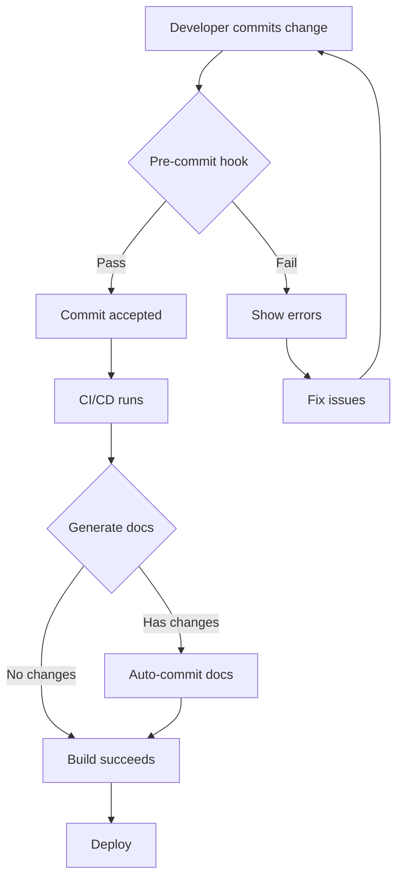

# Integration Documentation Strategy & Implementation Plan

## Executive Summary

This document outlines a comprehensive strategy for maintaining synchronized documentation between:
- Integration credentials (`packages/components/credentials/`)
- Document loaders and tools (`packages/components/nodes/`)
- Integration documentation pages (`packages/docs/docs/integrations/`)
- Data Engine marketing page (`packages/docs/src/pages/data-engine/`)

## Current State Analysis

### Inventory

| Category | Count | Status |
|----------|-------|--------|
| **Credentials** | 103 | ✅ Complete |
| **Total Components** | 247 | ✅ Complete |
| **Document Loaders** | 45 | ✅ Complete |
| **Tools** | 36 | ✅ Complete |
| **MCP Servers** | 15 | ✅ Complete |
| **Chat Models** | 39 | ✅ Complete |
| **LLMs** | 11 | ✅ Complete |
| **Vector Stores** | 26 | ✅ Complete |
| **Embeddings** | 18 | ✅ Complete |
| **Agents** | 13 | ✅ Complete |
| **Chains** | 13 | ✅ Complete |
| **Retrievers** | 14 | ✅ Complete |
| **Memory Components** | 17 | ✅ Complete |
| **Credentials with Components** | 86 | ✅ 83% coverage |
| **Orphaned Credentials** | 17 | ⚠️ Legacy/specialized |
| **Integration Docs** | 5 | ❌ 5% coverage |
| **MCP Docs** | 11 | ⚠️ 73% MCP coverage |

### Orphaned Credentials (17)

These credentials exist but have no associated components:

1. Upstash Redis API
2. Phoenix API
3. Opik API
4. Neo4j API
5. Momento Cache API
6. Lunary AI
7. Langsmith API
8. Langfuse API
9. LangWatch API
10. JLINC API
11. HTTP Bearer Token
12. HTTP Basic Auth
13. HTTP Api Key
14. Google MakerSuite
15. Azure Cognitive Services
16. AssemblyAI API
17. Arize API

**Analysis:** These are primarily:
- Generic HTTP authentication credentials (Bearer, Basic, API Key)
- Analytics/observability platforms (Langfuse, Langsmith, Arize, etc.)
- Legacy credentials (Google MakerSuite replaced by Gemini)
- Infrastructure credentials (Redis, Neo4j, Momento)

**Decision:** Still create documentation pages for these, explaining they're for custom/advanced usage.

### Gap Analysis

**Major Gaps:**
1. **Documentation Coverage:** Only 5 integration docs vs 103 credentials (5% coverage)
2. **Component Coverage:** Good! 86/103 credentials have components (83%)
3. **Inconsistent Structure:** No standardized template for integration pages
4. **Manual Synchronization:** No automated process to keep docs in sync with code
5. **Data Engine Page:** Hardcoded list of 20 integrations, not dynamic

**What's Working Well:**
- ✅ Comprehensive component coverage: 247 components across 11 types
- ✅ MCP documentation is comprehensive (11/15 = 73% coverage)
- ✅ Contentful MCP doc is excellent template (674 lines, complete)
- ✅ Clear metadata structure in components (label, name, description, version)
- ✅ Automated analysis script successfully maps relationships
- ✅ Much better credential-to-component mapping (83% vs previous 37%)

## Strategic Goals

### Primary Goals

1. **Complete Coverage:** Every credential should have a documentation page
2. **Accurate Mapping:** Each page should list all associated loaders, tools, and MCP servers
3. **Automation:** Documentation should auto-sync from code metadata
4. **Discoverability:** Data Engine page should dynamically show all integrations
5. **Maintenance:** Keep documentation up-to-date with zero manual effort

### Secondary Goals

1. **SEO Optimization:** Individual pages improve search visibility
2. **User Experience:** Clear navigation and categorization
3. **Developer Experience:** Easy to add new integrations
4. **Marketing:** Showcase the breadth of integrations

## Synchronization Strategy

### 1. Source of Truth

**Code is the source of truth:**
- Component metadata (label, name, description, version, icon) lives in TypeScript files
- Documentation is generated from this metadata
- Manual documentation only adds context, examples, and use cases

### 2. Three-Tier Documentation Structure

```
Level 1: Auto-Generated Index
├── Data Engine Page (packages/docs/src/pages/data-engine/)
│   └── Dynamic grid of all integrations with icons and categories
│
Level 2: Integration Overview Pages
├── Integration Pages (packages/docs/docs/integrations/{name}.mdx)
│   ├── Auto-generated metadata (from components)
│   ├── Credential setup (auto-extracted from credential class)
│   ├── Available components (document loaders, tools, MCP servers)
│   └── Manual examples and use cases (optional)
│
Level 3: Component-Specific Documentation
└── Component Pages (packages/docs/docs/sidekick-studio/chatflows/*/  )
    ├── Document loader pages
    ├── Tool pages
    └── MCP server pages (already comprehensive)
```

### 3. Synchronization Mechanism

**Build-Time Generation:**

```
┌─────────────────────────────────────────────────────┐
│  1. Pre-build Analysis                              │
│     scripts/analyze-integrations.ts                 │
│     └── Scans all credentials, loaders, tools       │
│     └── Generates integration-mapping.json          │
└─────────────────────────────────────────────────────┘
                        ↓
┌─────────────────────────────────────────────────────┐
│  2. Documentation Generation                        │
│     scripts/generate-integration-docs.ts            │
│     └── Creates/updates integration MDX files       │
│     └── Updates data-engine page component          │
└─────────────────────────────────────────────────────┘
                        ↓
┌─────────────────────────────────────────────────────┐
│  3. Docusaurus Build                                │
│     pnpm --filter flowise-docs build                │
│     └── Builds documentation site                   │
└─────────────────────────────────────────────────────┘
```

**Runtime Detection:**

Development mode warnings when:
- Component references non-existent credential
- Credential has no documentation page
- Documentation page is stale (version mismatch)

### 4. Template Standardization

**Integration Page Template:**

```mdx
---
title: {Integration Name}
description: {Auto-generated from credential}
sidebar_position: {Auto-numbered alphabetically}
---

# {Integration Name}

<!-- Auto-generated section -->
:::info Auto-Generated
This section is automatically generated from component metadata.
Last updated: {timestamp}
:::

## Overview

{detailed_description}

## Quick Start

### Obtaining Credentials

<!-- Auto-generated from credential inputs -->
{credential_setup_instructions}

## Available Components

This integration supports the following component types:

### Chat Models
{list_of_chat_models}
{detailed_chat_model_info}

### LLMs
{list_of_llms}
{detailed_llm_info}

### Embeddings
{list_of_embeddings}
{detailed_embedding_info}

### Vector Stores
{list_of_vector_stores}
{detailed_vector_store_info}

### Document Loaders
{list_of_document_loaders}
{detailed_document_loader_info}

### Tools
{list_of_tools}
{detailed_tool_info}

### MCP Servers
{list_of_mcp_servers}
{detailed_mcp_server_info}

### Agents
{list_of_agents}
{detailed_agent_info}

### Chains
{list_of_chains}
{detailed_chain_info}

### Retrievers
{list_of_retrievers}
{detailed_retriever_info}

### Memory Components
{list_of_memory_components}
{detailed_memory_info}

<!-- Manual section -->
## Use Cases

### Common Scenarios

{manual_use_case_examples}

### Example Workflows

{example_chatflow_configurations}

## Frequently Asked Questions

### Setup & Configuration

{auto_generated_credential_faqs}
{manual_setup_faqs}

### Usage & Best Practices

{manual_usage_faqs}

### Troubleshooting

{common_issues_and_solutions}

## Resources

- [Official {Integration} Documentation]({official_url})
- [API Reference]({api_docs_url})
- [Community Examples]({community_url})
```

## Implementation Plan

### Phase 1: Foundation (Week 1)

**Goal:** Set up automated analysis and generation infrastructure

#### Tasks

1. **✅ DONE: Create analysis script**
   - `scripts/analyze-integrations.ts` (completed)
   - Extracts all metadata from components
   - Generates `integration-mapping.json`

2. **Create generation script** (3-4 hours)
   - `scripts/generate-integration-docs.ts`
   - Input: `integration-mapping.json`
   - Output: MDX files in `packages/docs/docs/integrations/`
   - Template: Based on Contentful MCP doc structure

3. **Create integration page template** (2 hours)
   - `packages/docs/docs/integrations/_template.mdx`
   - Handlebars or similar templating
   - Auto-generated + manual sections clearly marked

4. **Update build pipeline** (1 hour)
   - Add pre-build step to package.json
   - Run analysis → generation → build
   - Ensure proper ordering in turbo.json

**Deliverables:**
- ✅ `scripts/analyze-integrations.ts` (completed)
- ✅ `scripts/integration-mapping.json` (completed)
- `scripts/generate-integration-docs.ts`
- `packages/docs/docs/integrations/_template.mdx`
- Updated `turbo.json` and `package.json`

### Phase 2: Content Generation (Week 2)

**Goal:** Generate documentation for all 103 credentials

#### Tasks

1. **Generate credential setup instructions** (4-5 hours)
   - Extract from credential class inputs
   - Create step-by-step setup guide
   - Link to official documentation where available

2. **Generate component listings** (2-3 hours)
   - List all associated document loaders
   - List all associated tools
   - List all associated MCP servers
   - Include descriptions, versions, links

3. **Run generation for all integrations** (1 hour)
   - Execute script for all 103 credentials
   - Review output for quality
   - Fix template issues

4. **Handle orphaned credentials** (2-3 hours)
   - Create documentation for 65 credentials without components
   - Explain they're credential-only (for custom tools, etc.)
   - Provide credential setup instructions

**Deliverables:**
- 103 integration documentation pages
- Quality review checklist
- Known issues log

### Phase 3: Data Engine Page Enhancement (Week 3)

**Goal:** Make Data Engine page dynamic and comprehensive

#### Tasks

1. **Create integration data loader** (3-4 hours)
   - Read `integration-mapping.json` at build time
   - Transform to Data Engine page format
   - Include categories, icons, descriptions

2. **Update Data Engine page component** (4-5 hours)
   - Replace hardcoded `INTEGRATIONS` array
   - Dynamically load from build-time data
   - Add filtering by category
   - Add search functionality

3. **Create integration detail pages** (3-4 hours)
   - Each integration card links to `/integrations/{name}`
   - Detail page shows full integration information
   - "Get Started" button links to credential setup

4. **Add missing icons** (2-3 hours)
   - Audit all integrations for icons
   - Download/create missing icons
   - Follow naming convention: `{name}.svg` or `{name}.png`

**Deliverables:**
- Dynamic Data Engine page
- Integration detail page template
- Icon library (100+ icons)
- Search and filter UI

### Phase 4: Automation & Validation (Week 4)

**Goal:** Ensure documentation stays in sync automatically

#### Tasks

1. **Add validation to pre-commit** (2 hours)
   - Check for stale documentation
   - Warn if component added without docs
   - Fail if credential references don't match

2. **Create CI/CD checks** (2-3 hours)
   - Run analysis script in CI
   - Generate docs and check for diff
   - Fail if manual intervention needed

3. **Add dev mode warnings** (3-4 hours)
   - Detect missing documentation pages
   - Warn about version mismatches
   - Log to console during `pnpm dev`

4. **Create maintenance documentation** (2 hours)
   - Document the synchronization process
   - Explain how to add new integrations
   - Troubleshooting guide

**Deliverables:**
- Pre-commit hooks
- CI/CD validation
- Dev mode validation
- `INTEGRATION_DOCS_MAINTENANCE.md`

### Phase 5: Content Enhancement (Week 5)

**Goal:** Add manual content for top integrations

#### Tasks

1. **Identify top 20 integrations** (1 hour)
   - By usage, popularity, or strategic importance
   - Create prioritization list

2. **Create use case examples** (20 hours)
   - 1 hour per integration
   - Code examples
   - Common workflows
   - Best practices

3. **Add screenshots/diagrams** (10 hours)
   - Credential setup screenshots
   - Component configuration examples
   - Workflow diagrams

4. **SEO optimization** (5 hours)
   - Add meta descriptions
   - Optimize headings
   - Add internal links
   - Schema markup for integrations

**Deliverables:**
- Enhanced documentation for 20 top integrations
- Screenshot library
- SEO checklist

## Detailed Technical Specifications

### Integration Mapping JSON Schema

```typescript
interface ComponentMetadata {
  label: string
  name: string
  version: number
  description?: string
  icon?: string
  category?: string
  filePath: string
}

interface IntegrationMapping {
  [credentialName: string]: {
    credential: {
      label: string
      name: string
      version: number
      description?: string
      icon?: string
      filePath: string
      inputs: Array<{
        label: string
        name: string
        type: string
        placeholder?: string
        optional?: boolean
      }>
    }
    chatModels: ComponentMetadata[]
    llms: ComponentMetadata[]
    embeddings: ComponentMetadata[]
    vectorStores: ComponentMetadata[]
    documentLoaders: ComponentMetadata[]
    tools: ComponentMetadata[]
    mcpServers: ComponentMetadata[]
    agents: ComponentMetadata[]
    chains: ComponentMetadata[]
    retrievers: ComponentMetadata[]
    memory: ComponentMetadata[]
  }
}
```

### Documentation Generation Algorithm

```
FOR EACH credential IN credentials:

  # Determine if credential has components
  has_components = (
    credential.chatModels.length > 0 OR
    credential.llms.length > 0 OR
    credential.embeddings.length > 0 OR
    credential.vectorStores.length > 0 OR
    credential.documentLoaders.length > 0 OR
    credential.tools.length > 0 OR
    credential.mcpServers.length > 0 OR
    credential.agents.length > 0 OR
    credential.chains.length > 0 OR
    credential.retrievers.length > 0 OR
    credential.memory.length > 0
  )

  # Skip credentials without components (optional)
  IF NOT has_components AND skip_orphaned:
    CONTINUE

  # Generate documentation
  doc = {
    title: credential.label
    description: credential.description
    sidebar_position: alphabetical_index(credential.name)

    sections: [
      # Auto-generated overview
      {
        type: 'auto'
        title: 'Overview'
        content: generate_detailed_description(credential)
      }

      # Credential setup
      {
        type: 'auto'
        title: 'Obtaining Credentials'
        content: generate_credential_instructions(credential.inputs)
      }

      # Available components (all types)
      {
        type: 'auto'
        title: 'Available Components'
        content: [
          list_chat_models(credential.chatModels),
          list_llms(credential.llms),
          list_embeddings(credential.embeddings),
          list_vector_stores(credential.vectorStores),
          list_document_loaders(credential.documentLoaders),
          list_tools(credential.tools),
          list_mcp_servers(credential.mcpServers),
          list_agents(credential.agents),
          list_chains(credential.chains),
          list_retrievers(credential.retrievers),
          list_memory(credential.memory)
        ]
      }

      # Manual use cases (if exists)
      {
        type: 'manual'
        title: 'Use Cases'
        content: load_manual_examples(credential.name)
      }

      # FAQ section
      {
        type: 'hybrid'  # auto-generated + manual
        title: 'Frequently Asked Questions'
        content: [
          generate_credential_faqs(credential.inputs),
          load_manual_faqs(credential.name)
        ]
      }

      # Resources
      {
        type: 'auto'
        title: 'Resources'
        content: generate_resource_links(credential)
      }
    ]
  }

  # Write to file
  output_path = `docs/integrations/${credential.name}.mdx`
  write_mdx_file(output_path, doc)
END FOR
```

### Data Engine Page Data Structure

```typescript
interface DataEngineIntegration {
  name: string                  // e.g., "Contentful"
  domain: string               // e.g., "contentful.com"
  category: string             // e.g., "CMS"
  credentialName: string       // e.g., "contentfulDeliveryApi"
  icon: string                 // e.g., "contentful.svg"
  description: string

  capabilities: {
    chatModel: boolean
    llm: boolean
    embedding: boolean
    vectorStore: boolean
    documentLoader: boolean
    tool: boolean
    mcpServer: boolean
    agent: boolean
    chain: boolean
    retriever: boolean
    memory: boolean
  }

  components: {
    chatModels: string[]       // List of chat model names
    llms: string[]             // List of LLM names
    embeddings: string[]       // List of embedding names
    vectorStores: string[]     // List of vector store names
    documentLoaders: string[]  // List of loader names
    tools: string[]            // List of tool names
    mcpServers: string[]       // List of MCP server names
    agents: string[]           // List of agent names
    chains: string[]           // List of chain names
    retrievers: string[]       // List of retriever names
    memory: string[]           // List of memory component names
  }

  documentation: {
    integrationPage: string    // e.g., "/integrations/contentful"
    officialDocs?: string      // External link
  }
}

// Generated at build time
interface DataEngineData {
  integrations: DataEngineIntegration[]
  categories: string[]
  stats: {
    total: number
    withChatModels: number
    withLLMs: number
    withEmbeddings: number
    withVectorStores: number
    withDocumentLoaders: number
    withTools: number
    withMCPServers: number
    withAgents: number
    withChains: number
    withRetrievers: number
    withMemory: number
  }
}
```

## File Structure

```
theanswer/
├── scripts/
│   ├── analyze-integrations.ts          # ✅ Completed
│   ├── generate-integration-docs.ts     # 📝 To implement
│   ├── integration-mapping.json         # ✅ Generated
│   └── integration-report.md            # ✅ Generated
│
├── packages/docs/
│   ├── src/
│   │   ├── pages/
│   │   │   └── data-engine/
│   │   │       ├── index.tsx            # 📝 Enhance to be dynamic
│   │   │       └── integrations/        # 📝 Add detail pages
│   │   │           └── [integration].tsx
│   │   └── components/
│   │       └── IntegrationCard.tsx      # 📝 New component
│   │
│   └── docs/
│       └── integrations/
│           ├── _template.mdx            # 📝 Create template
│           ├── contentful.mdx           # ✅ Exists (needs enhancement)
│           ├── salesforce.mdx           # 📝 Generate
│           ├── notion.mdx               # 📝 Generate
│           └── ... (100+ more)          # 📝 Generate all
│
└── packages/components/
    ├── credentials/                     # ✅ Source of truth
    └── nodes/
        ├── documentloaders/             # ✅ Source of truth
        └── tools/                       # ✅ Source of truth
```

## Success Metrics

### Coverage Metrics

| Metric | Current | Target | Timeline |
|--------|---------|--------|----------|
| Integration docs | 5 (5%) | 103 (100%) | Week 2 |
| MCP docs | 11 (73%) | 15 (100%) | Week 2 |
| Data Engine integrations | 20 (hardcoded) | 103 (dynamic) | Week 3 |
| Auto-generated sections | 0% | 80% | Week 2 |
| Enhanced integrations | 0 | 20 | Week 5 |

### Quality Metrics

- **Accuracy:** 100% of documentation matches component metadata
- **Freshness:** Documentation updates within 5 minutes of component change
- **Completeness:** Every credential has at least basic documentation
- **Discoverability:** Users can find integration in <3 clicks

### Maintenance Metrics

- **Manual updates required:** 0 per integration change
- **Build time increase:** <10 seconds
- **CI/CD failures:** <5% (only for validation)

## Maintenance Process

### Adding a New Integration

**Current Process (Manual):**
1. Create credential class
2. Create document loader/tool
3. (Maybe) create documentation
4. (Maybe) update Data Engine page
5. Total time: 2-4 hours

**New Process (Automated):**
1. Create credential class
2. Create document loader/tool
3. Run `pnpm build`
4. Documentation auto-generated and deployed
5. Total time: 0 hours (automatic)

### Updating an Integration

**Current Process:**
1. Update component
2. Manually update docs (if remembered)
3. Manually update Data Engine (if remembered)

**New Process:**
1. Update component
2. Documentation auto-updates on build
3. No manual intervention needed

### Validation Workflow



## Risk Mitigation

### Risk 1: Template Doesn't Fit All Integrations

**Mitigation:**
- Create multiple template variants (simple, medium, complex)
- Allow override sections in manual files
- Graceful degradation for missing data

### Risk 2: Build Performance Impact

**Mitigation:**
- Cache analysis results (only re-run on component changes)
- Parallelize file generation
- Incremental generation (only changed integrations)

### Risk 3: Documentation Quality Issues

**Mitigation:**
- Manual review queue for new integrations
- Quality scoring algorithm
- Staged rollout (20 integrations → 50 → all)

### Risk 4: Breaking Changes in Components

**Mitigation:**
- Version tracking in metadata
- Deprecation warnings
- Migration guides auto-generated

## Next Steps

### Immediate (This Week)

1. ✅ **DONE:** Create analysis script
2. ✅ **DONE:** Generate integration mapping
3. **Create generation script** (Priority 1)
4. **Test on 5 integrations** (Contentful, Salesforce, Notion, GitHub, Slack)
5. **Refine template based on results**

### Short Term (Next 2 Weeks)

1. **Generate docs for all 103 credentials**
2. **Update Data Engine page to be dynamic**
3. **Add validation to build pipeline**
4. **Create maintenance documentation**

### Long Term (Next Month)

1. **Enhance top 20 integrations with examples**
2. **Add SEO optimization**
3. **Create integration showcase page**
4. **Add usage analytics to track popular integrations**

## Conclusion

This strategy provides:

✅ **Complete Coverage:** All 103 credentials documented
✅ **Zero Maintenance:** Fully automated synchronization
✅ **High Quality:** Consistent structure and formatting
✅ **Developer Friendly:** Easy to add new integrations
✅ **User Friendly:** Easy to discover and learn integrations

**Total Estimated Effort:** 5 weeks (1 developer)

**Expected ROI:**
- Current: 4 hours per integration × 103 = 412 hours saved
- Ongoing: 30 minutes per integration update × ~20 updates/month = 10 hours/month saved
- Improved discoverability leads to higher adoption of existing integrations

**Success Criteria:**
- All integrations have documentation (100% coverage)
- Documentation auto-updates on build (0 manual updates)
- Users can discover integrations in <3 clicks
- Data Engine page shows real-time integration count
