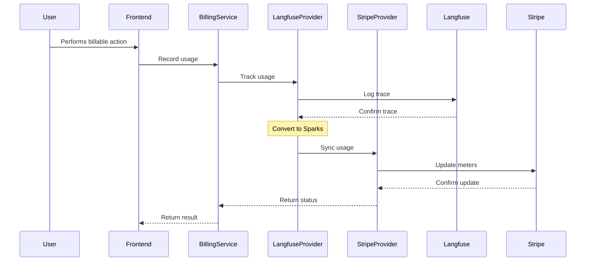
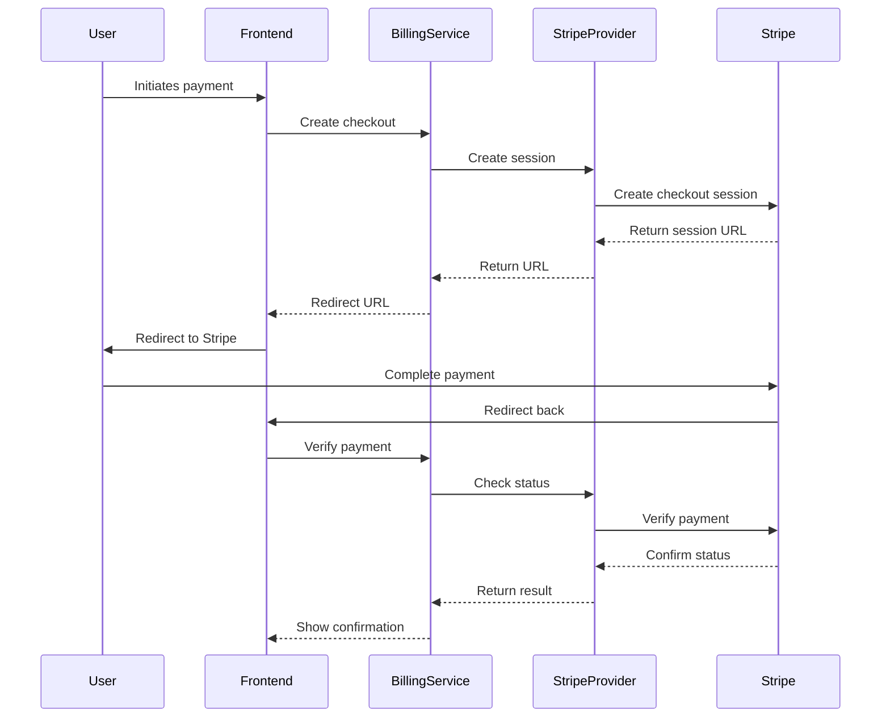
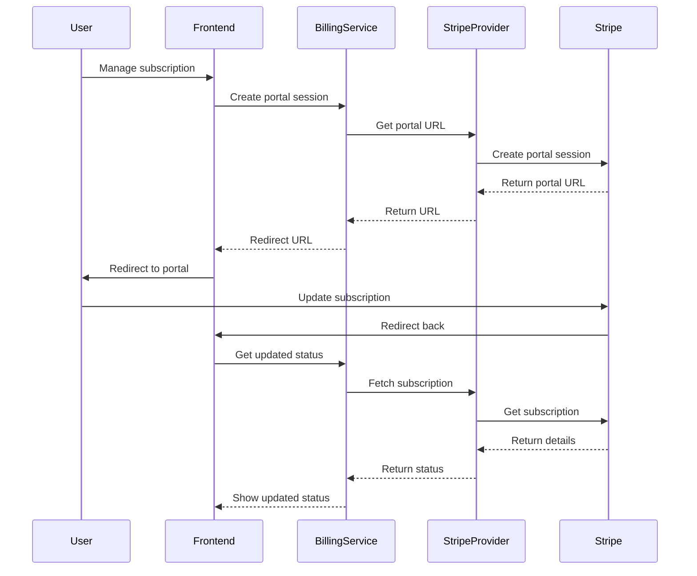

# Billing System Flow

## Usage Tracking Flow

```mermaid
sequenceDiagram
    participant User
    participant Frontend
    participant BillingService
    participant LangfuseProvider
    participant StripeProvider
    participant Langfuse
    participant Stripe

    User->>Frontend: Performs billable action
    Frontend->>BillingService: Record usage
    BillingService->>LangfuseProvider: Track usage
    LangfuseProvider->>Langfuse: Log trace
    Langfuse-->>LangfuseProvider: Confirm trace

    Note over LangfuseProvider: Convert to Sparks

    LangfuseProvider->>StripeProvider: Sync usage
    StripeProvider->>Stripe: Update meters
    Stripe-->>StripeProvider: Confirm update
    StripeProvider-->>BillingService: Return status
    BillingService-->>Frontend: Return result
```

## Payment Flow

```mermaid
sequenceDiagram
    participant User
    participant Frontend
    participant BillingService
    participant StripeProvider
    participant Stripe

    User->>Frontend: Initiates payment
    Frontend->>BillingService: Create checkout
    BillingService->>StripeProvider: Create session
    StripeProvider->>Stripe: Create checkout session
    Stripe-->>StripeProvider: Return session URL
    StripeProvider-->>BillingService: Return URL
    BillingService-->>Frontend: Redirect URL
    Frontend->>User: Redirect to Stripe

    User->>Stripe: Complete payment
    Stripe->>Frontend: Redirect back
    Frontend->>BillingService: Verify payment
    BillingService->>StripeProvider: Check status
    StripeProvider->>Stripe: Verify payment
    Stripe-->>StripeProvider: Confirm status
    StripeProvider-->>BillingService: Return result
    BillingService-->>Frontend: Show confirmation
```

## Subscription Management Flow

```mermaid
sequenceDiagram
    participant User
    participant Frontend
    participant BillingService
    participant StripeProvider
    participant Stripe

    User->>Frontend: Manage subscription
    Frontend->>BillingService: Create portal session
    BillingService->>StripeProvider: Get portal URL
    StripeProvider->>Stripe: Create portal session
    Stripe-->>StripeProvider: Return portal URL
    StripeProvider-->>BillingService: Return URL
    BillingService-->>Frontend: Redirect URL
    Frontend->>User: Redirect to portal

    User->>Stripe: Update subscription
    Stripe->>Frontend: Redirect back
    Frontend->>BillingService: Get updated status
    BillingService->>StripeProvider: Fetch subscription
    StripeProvider->>Stripe: Get subscription
    Stripe-->>StripeProvider: Return details
    StripeProvider-->>BillingService: Return status
    BillingService-->>Frontend: Show updated status
```
