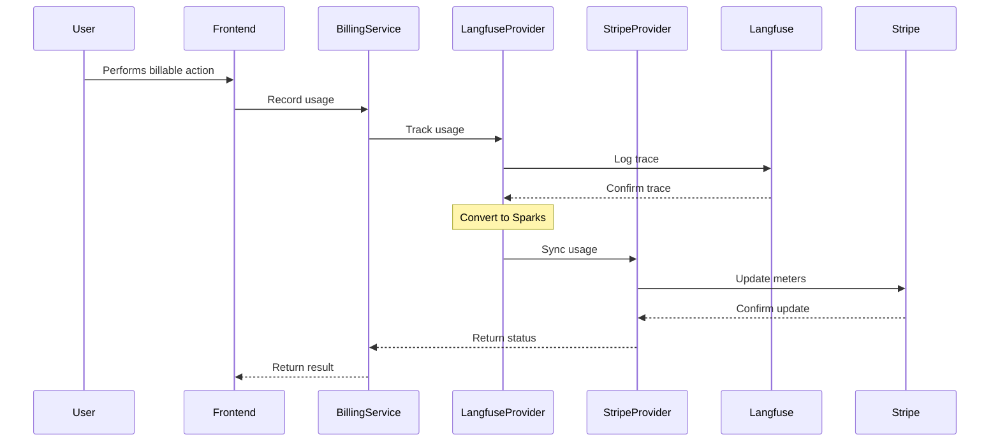
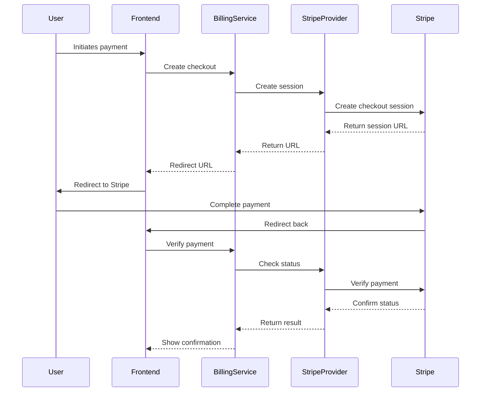
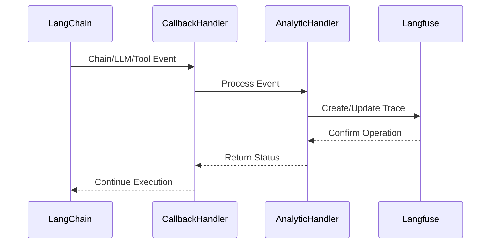

# Flowise Billing System Documentation

## Implementation Status

### Core Components Status

✅ = Implemented
🚧 = In Progress
❌ = Not Implemented

#### Database Schema

-   ✅ Core Schema Design: Organization-ready billing schema
-   ✅ Entity Implementation: All required entities with proper relationships
-   ✅ Performance Indexes: Optimized for common queries and reporting
-   ✅ Data Integrity: Proper constraints and audit trails
-   ✅ Migration Support: Database migrations with rollback capability

#### Backend Components

-   🚧 Core Billing Service: [`packages/server/src/services/billing/index.ts`](../packages/server/src/services/billing/index.ts)
-   🚧 Plan Management: [`packages/server/src/services/billing/plans.ts`](../packages/server/src/services/billing/plans.ts)
-   🚧 Stripe Integration: [`packages/server/src/aai-utils/billing/stripe/StripeProvider.ts`](../packages/server/src/aai-utils/billing/stripe/StripeProvider.ts)
-   🚧 Core Billing Logic: [`packages/server/src/aai-utils/billing/core/BillingService.ts`](../packages/server/src/aai-utils/billing/core/BillingService.ts)

#### Frontend Components

-   ✅ Billing Dashboard: [`packages-answers/ui/src/billing/BillingDashboard.tsx`](../packages-answers/ui/src/billing/BillingDashboard.tsx)
-   ✅ Billing Overview: [`packages-answers/ui/src/billing/BillingOverview.tsx`](../packages-answers/ui/src/billing/BillingOverview.tsx)
-   ✅ Purchase Subscription: [`packages-answers/ui/src/billing/PurchaseSubscription.tsx`](../packages-answers/ui/src/billing/PurchaseSubscription.tsx)
-   ✅ Usage Stats: [`packages-answers/ui/src/billing/UsageStats.tsx`](../packages-answers/ui/src/billing/UsageStats.tsx)
-   ✅ Cost Calculator: [`packages-answers/ui/src/billing/CostCalculator.tsx`](../packages-answers/ui/src/billing/CostCalculator.tsx)
-   ✅ Purchase Sparks: [`packages-answers/ui/src/billing/PurchaseSparks.tsx`](../packages-answers/ui/src/billing/PurchaseSparks.tsx)
-   ✅ Purchase Credits: [`packages-answers/ui/src/billing/PurchaseCredits.tsx`](../packages-answers/ui/src/billing/PurchaseCredits.tsx)
-   ✅ Pricing Overview: [`packages-answers/ui/src/billing/PricingOverview.tsx`](../packages-answers/ui/src/billing/PricingOverview.tsx)
-   ✅ Pricing Page: [`packages-answers/ui/src/billing/PricingPage.tsx`](../packages-answers/ui/src/billing/PricingPage.tsx)

## Overview

The Flowise billing system implements a sophisticated hybrid billing model that combines subscription-based and usage-based billing using Stripe as the payment processor. The system is designed to handle both trial and paid plans, with support for organization-level billing and individual user billing.z

## Core Components

### 1. Billing Service Architecture

The billing system is composed of several key components:

#### Backend Components

-   [`packages/server/src/services/billing/index.ts`](../packages/server/src/services/billing/index.ts): Core billing service
-   [`packages/server/src/services/billing/plans.ts`](../packages/server/src/services/billing/plans.ts): Plan management
-   [`packages/server/src/aai-utils/billing/stripe/StripeProvider.ts`](../packages/server/src/aai-utils/billing/stripe/StripeProvider.ts): Stripe integration
-   [`packages/server/src/aai-utils/billing/core/BillingService.ts`](../packages/server/src/aai-utils/billing/core/BillingService.ts): Core billing logic

#### Frontend Components

-   [`packages-answers/ui/src/billing/BillingDashboard.tsx`](../packages-answers/ui/src/billing/BillingDashboard.tsx): Main billing interface
-   [`packages-answers/ui/src/billing/PurchaseSubscription.tsx`](../packages-answers/ui/src/billing/PurchaseSubscription.tsx): Subscription management
-   [`packages-answers/ui/src/billing/UsageStats.tsx`](../packages-answers/ui/src/billing/UsageStats.tsx): Usage tracking
-   [`packages-answers/ui/src/billing/CostCalculator.tsx`](../packages-answers/ui/src/billing/CostCalculator.tsx): Cost estimation
-   [`packages-answers/ui/src/billing/PurchaseSparks.tsx`](../packages-answers/ui/src/billing/PurchaseSparks.tsx): Credit purchase interface

### 2. Billing Models

#### Subscription Plans

```typescript
const SUBSCRIPTION_TIERS = {
    FREE: {
        name: 'Free',
        sparksPerMonth: 10000,
        price: 0,
        priceId: 'price_free',
        features: [
            '10,000 Sparks',
            'Access to GPT-4o mini',
            'Standard voice chats',
            'Limited access to GPT-4o',
            'Basic compute and storage allocation',
            'Community support'
        ]
    },
    PLUS: {
        name: 'Plus',
        sparksPerMonth: 250_000,
        price: 20,
        priceId: 'price_1QdEegFeRAHyP6by6yTOvbwj',
        features: [
            '500,000 Sparks per month',
            'Full API access',
            'Extended compute and storage limits',
            'Access to advanced voice and video inputs',
            'Priority support',
            'Create and use custom GPTs',
            'Early access to new features'
        ]
    }
}
```

#### Usage-Based Billing (Sparks)

```typescript
const BILLING_CONFIG = {
    SPARK_TO_USD: 0.001, // 1 Spark = $0.001 USD
    RATES: {
        AI_TOKENS: {
            UNIT: 1000,
            SPARKS: 100,
            COST: 0.1
        },
        COMPUTE: {
            UNIT: 1, // minutes
            SPARKS: 50,
            COST: 0.05
        },
        STORAGE: {
            UNIT: 1, // GB per month
            SPARKS: 500,
            COST: 0.5
        }
    }
}
```

### 3. Usage Tracking

The system tracks usage across three main dimensions:

1. AI Token Consumption
2. Compute Resources
3. Storage Usage

Usage is tracked in real-time and aggregated daily for billing purposes. The system supports:

-   Per-user tracking for trial plans
-   Organization-level tracking for paid plans
-   Real-time usage monitoring
-   Automatic plan transitions based on usage

### 4. API Endpoints

The billing API endpoints are implemented in `packages/server/src/controllers/billing/index.ts`:

#### Plan Management

-   `GET /billing/plans/current`: Retrieve current plan details

    ```typescript
    // Implementation in packages/server/src/controllers/billing/index.ts
    const getCurrentPlan = async (req: Request, res: Response, next: NextFunction) => {
        try {
            const subscription = await billingService.getSubscriptionWithUsage(req.user.stripeCustomerId)
            return res.json(subscription)
        } catch (error) {
            next(error)
        }
    }
    ```

-   `GET /billing/plans/history`: Get plan usage history
-   `POST /billing/plans/check-executions`: Validate available executions

#### Subscription Management

-   `POST /billing/subscriptions`: Create new subscription
-   `PUT /billing/subscriptions/:id`: Update existing subscription
-   `DELETE /billing/subscriptions/:id`: Cancel subscription

#### Billing Portal

-   `POST /billing/portal-sessions`: Create Stripe billing portal session

### 5. Security & Best Practices

#### Security Implementation

The security measures are implemented across several files:

-   Organization-based access control: [`packages/server/src/middleware/auth.ts`](../packages/server/src/middleware/auth.ts)
-   Secure API key management: [`packages/server/src/services/billing/index.ts`](../packages/server/src/services/billing/index.ts)
-   Transaction-based usage tracking: [`packages/server/src/aai-utils/billing/core/BillingService.ts`](../packages/server/src/aai-utils/billing/core/BillingService.ts)
-   Environment-based configuration: [`packages/server/src/aai-utils/billing/config.ts`](../packages/server/src/aai-utils/billing/config.ts)

#### Best Practices Implementation

-   Usage validation: [`packages/server/src/services/billing/plans.ts`](../packages/server/src/services/billing/plans.ts)
-   Transactional updates: [`packages/server/src/aai-utils/billing/stripe/StripeProvider.ts`](../packages/server/src/aai-utils/billing/stripe/StripeProvider.ts)
-   Error handling: [`packages/server/src/controllers/billing/index.ts`](../packages/server/src/controllers/billing/index.ts)
-   Secure key storage: [`packages/server/src/aai-utils/billing/stripe/config.ts`](../packages/server/src/aai-utils/billing/stripe/config.ts)

### 6. Configuration

#### Environment Variables

The environment configuration is managed in `packages/server/src/aai-utils/billing/config.ts`:

```typescript
// Required environment variables
export const STRIPE_CONFIG = {
    STRIPE_SECRET_KEY: process.env.STRIPE_SECRET_KEY!,
    STRIPE_WEBHOOK_SECRET: process.env.STRIPE_WEBHOOK_SECRET!,
    TRIAL_PLAN_EXECUTIONS: process.env.TRIAL_PLAN_EXECUTIONS || '1000',
    PUBLIC_ORG_ID: process.env.PUBLIC_ORG_ID!
}
```

### 7. Error Handling

Error handling is implemented across multiple files:

1. Billing Service Errors (`packages/server/src/services/billing/index.ts`):

    - Insufficient credits/sparks
    - Invalid plan transitions
    - Payment processing failures
    - Organization not found
    - Subscription validation errors

2. Stripe Provider Errors (`packages/server/src/aai-utils/billing/stripe/StripeProvider.ts`):

    - Payment method errors
    - Subscription update failures
    - Usage tracking errors
    - Webhook processing errors

3. Controller Error Handling (`packages/server/src/controllers/billing/index.ts`):
    - Request validation errors
    - Authentication errors
    - Authorization errors
    - Internal server errors

## Integration Guide

### 1. Setting Up Stripe Integration

Implementation in `packages/server/src/aai-utils/billing/stripe/config.ts`:

```typescript
import Stripe from 'stripe'

// Initialize Stripe client with proper configuration
export const stripe = new Stripe(process.env.STRIPE_SECRET_KEY!, {
    apiVersion: '2023-10-16',
    typescript: true,
    maxNetworkRetries: 3
})
```

### 2. Implementing Usage Tracking

Implementation in `packages/server/src/aai-utils/billing/core/BillingService.ts`:

```typescript
async trackUsage(params: {
    organizationId: string
    usage: {
        ai_tokens: number
        compute_minutes: number
        storage_gb: number
    }
}) {
    // Implementation details in BillingService
    await this.usageProvider.trackUsage(params)
}
```

### 3. Handling Plan Transitions

Implementation in `packages/server/src/services/billing/plans.ts`:

```typescript
async upgradePlan({
    organizationId,
    newPlanId,
    paymentMethodId
}: {
    organizationId: string
    newPlanId: string
    paymentMethodId: string
}) {
    // Implementation details in plans.ts
}
```

## Database Schema

### Core Entities

#### Subscription

```typescript
@Entity()
@Unique(['entityType', 'entityId'])
export class Subscription {
    @PrimaryGeneratedColumn('uuid')
    id: string

    @Column({ type: 'varchar', length: 50 })
    entityType: 'user' | 'organization'

    @Column({ type: 'uuid' })
    entityId: string

    @Column({ type: 'uuid', nullable: true })
    organizationId: string

    @Column({ type: 'varchar', length: 50 })
    subscriptionType: 'FREE' | 'PAID' | 'ENTERPRISE'

    @Column({ unique: true })
    stripeSubscriptionId: string

    // ... other fields
}
```

#### UsageEvent

```typescript
@Entity()
@Index(['organizationId', 'createdDate'])
@Index(['entityType', 'entityId', 'createdDate'])
export class UsageEvent {
    @Column({ type: 'varchar', length: 50 })
    entityType: 'user' | 'organization'

    @Column({ type: 'uuid' })
    entityId: string

    @Column({ type: 'uuid', nullable: true })
    organizationId: string

    @Column({ type: 'varchar', length: 50 })
    resourceType: 'AI_TOKENS' | 'COMPUTE'

    // ... other fields
}
```

### Key Features

1. Organization Support

    - All entities support organization-level operations
    - Ready for credit pooling
    - Hierarchical blocking support
    - Efficient organization-level reporting

2. Subscription Types

    - FREE: 10,000 credits
    - PAID: 500,000 credits
    - ENTERPRISE: Custom limits

3. Performance Optimizations

    - Composite indexes for reporting
    - Proper constraints for data integrity
    - Efficient querying support

4. Usage Tracking
    - Resource-type specific tracking
    - Credit consumption tracking
    - Stripe meter integration
    - Organization-level aggregation

### Database Indexes

1. Subscription Indexes

    - Primary key on id
    - Unique constraint on entityType + entityId
    - Index on organizationId

2. Usage Event Indexes

    - Composite index on organizationId + createdDate
    - Composite index on entityType + entityId + createdDate
    - Index on stripeMeterEventId

3. Blocking Status Indexes
    - Unique constraint on entityType + entityId
    - Index on organizationId

### Best Practices

1. Data Integrity

    - Use of proper constraints
    - Audit trail fields
    - Proper relationship management

2. Performance

    - Efficient indexing strategy
    - Timestamp with timezone
    - JSONB for flexible data

3. Security
    - No sensitive data storage
    - Proper relationship validation
    - Audit trail support

### Migration Support

1. Database Migrations

    - Generated TypeORM migrations
    - Proper rollback support
    - Data integrity preservation

2. Performance Considerations

    - Minimal downtime required
    - No blocking operations
    - Safe rollback procedures

3. Deployment Strategy
    - Step-by-step migration guide
    - Validation checkpoints
    - Rollback procedures

## Maintenance & Monitoring

### Key Metrics to Monitor

1. Usage patterns per organization
2. Payment success/failure rates
3. Plan transition frequencies
4. API endpoint performance
5. Stripe webhook reliability

### Regular Maintenance Tasks

1. Validate usage calculations
2. Monitor failed payments
3. Update pricing configurations
4. Review security settings
5. Audit access logs

## Implementation Details

### 1. Stripe Integration

#### Core Components

-   `StripeProvider` class handles all Stripe-related operations
-   `BillingService` class orchestrates between different providers (Stripe, Langfuse)
-   Webhook handlers for real-time event processing

#### Usage Tracking Implementation

```typescript
// Example of usage tracking with Stripe meter events
const meterEvent = await stripeClient.billing.meterEvents.create({
    event_name: 'sparks',
    identifier: `${traceId}_sparks_${timestamp}`,
    timestamp,
    payload: {
        value: totalSparksWithMargin.toString(),
        stripe_customer_id: customerId,
        trace_id: traceId,
        ai_tokens_sparks: (sparks.ai_tokens * MARGIN_MULTIPLIER).toString(),
        compute_sparks: (sparks.compute * MARGIN_MULTIPLIER).toString(),
        storage_sparks: (sparks.storage * MARGIN_MULTIPLIER).toString(),
        ai_tokens_cost: (costs.base.ai * MARGIN_MULTIPLIER).toFixed(6),
        compute_cost: (costs.base.compute * MARGIN_MULTIPLIER).toFixed(6),
        storage_cost: (costs.base.storage * MARGIN_MULTIPLIER).toFixed(6),
        total_cost_with_margin: totalCostWithMargin.toFixed(6)
    }
})
```

### 2. Billing Service Architecture

#### Provider Interface

```typescript
interface BillingProvider {
    createCustomer(params: CreateCustomerParams): Promise<BillingCustomer>
    attachPaymentMethod(params: AttachPaymentMethodParams): Promise<PaymentMethod>
    createCheckoutSession(params: CreateCheckoutSessionParams): Promise<CheckoutSession>
    createBillingPortalSession(params: CreateBillingPortalSessionParams): Promise<BillingPortalSession>
    updateSubscription(params: UpdateSubscriptionParams): Promise<Subscription>
    cancelSubscription(subscriptionId: string): Promise<Subscription>
    getUpcomingInvoice(params: GetUpcomingInvoiceParams): Promise<Invoice>
    getUsageSummary(customerId: string): Promise<UsageStats>
    syncUsageToStripe(traceId?: string): Promise<{
        processedTraces: string[]
        failedTraces: Array<{ traceId: string; error: string }>
    }>
    listSubscriptions(params: Stripe.SubscriptionListParams): Promise<Stripe.Response<Stripe.ApiList<Stripe.Subscription>>>
    getSubscriptionWithUsage(subscriptionId: string): Promise<SubscriptionWithUsage>
}
```

### 3. Usage Tracking Details

#### Trace Metadata

```typescript
interface TraceMetadata {
    chatId?: string
    chatflowid?: string
    userId?: string
    customerId?: string
    subscriptionId?: string // Stripe subscription ID
    subscriptionTier?: string
    stripeBilled?: boolean
    stripeProcessing?: boolean
    stripeProcessingStartedAt?: string
    stripeBilledAt?: string
    sparksBilled?: Record<string, number>
    stripeError?: string
    stripeBilledTypes?: string[]
    stripePartialBilled?: boolean
    [key: string]: any // Additional metadata fields
}
```

### 4. Error Handling Implementation

#### Stripe Error Handling

```typescript
try {
    const result = await stripeClient.billing.meterEvents.create({...})
} catch (error: any) {
    // Handle customer not found
    if (error.code === 'resource_missing' && error.param === 'payload[stripe_customer_id]') {
        log.warn('Customer not found, falling back to default customer')
        // Retry with default customer
        await stripeClient.billing.meterEvents.create({
            ...originalParams,
            payload: {
                ...originalParams.payload,
                stripe_customer_id: DEFAULT_CUSTOMER_ID
            }
        })
    } else {
        throw error
    }
}
```

### 5. Subscription Management Implementation

#### Subscription Updates

```typescript
async updateSubscription(params: UpdateSubscriptionParams): Promise<Subscription> {
    const subscription = await stripeClient.subscriptions.retrieve(params.subscriptionId)

    return await stripeClient.subscriptions.update(params.subscriptionId, {
        items: [{
            id: subscription.items.data[0].id,
            price: params.priceId
        }],
        proration_behavior: 'create_prorations'
    })
}
```

### 6. Usage Monitoring Implementation

#### Usage Stats Collection

```typescript
async getSubscriptionWithUsage(subscriptionId?: string): Promise<Subscription & { usage?: any }> {
    const { data: [subscription] = [] } = await stripeClient.subscriptions.list({
        customer: subscriptionId,
        status: 'active',
        limit: 1
    })

    // Get usage for current month
    const now = new Date()
    const startOfMonth = new Date(now.getFullYear(), now.getMonth(), 1)
    const startTime = Math.floor(startOfMonth.getTime() / 1000)
    const endTime = Math.floor(now.getTime() / 1000)

    // Align timestamps with daily boundaries
    const alignedStartTime = Math.floor(startTime / 86400) * 86400
    const alignedEndTime = Math.ceil(endTime / 86400) * 86400

    const summaries = await this.getMeterEventSummaries(
        subscription.customer as string,
        alignedStartTime,
        alignedEndTime
    )

    return {
        ...subscription,
        usage: summaries.data
    }
}
```

### 7. Security Considerations

#### Environment Configuration

```typescript
// Secure initialization of Stripe client
const stripe = new Stripe(process.env.STRIPE_SECRET_KEY!, {
    apiVersion: '2023-10-16',
    typescript: true,
    maxNetworkRetries: 3
})

// Required environment variables
const requiredEnvVars = ['STRIPE_SECRET_KEY', 'STRIPE_WEBHOOK_SECRET', 'TRIAL_PLAN_EXECUTIONS', 'PUBLIC_ORG_ID']
```

## Testing & Development

### Local Development Setup

1. Set up Stripe webhook forwarding:

    ```bash
    stripe listen --forward-to localhost:3000/api/billing/webhook
    ```

2. Configure test environment:
    ```bash
    export STRIPE_SECRET_KEY=sk_test_...
    export STRIPE_WEBHOOK_SECRET=whsec_...
    ```

### Testing Checklist

1. Subscription creation and management
2. Usage tracking accuracy
3. Webhook handling
4. Error scenarios
5. Security measures
6. Performance monitoring

## Deployment Considerations

### Production Deployment

1. Configure production Stripe keys
2. Set up webhook endpoints
3. Configure error monitoring
4. Set up usage alerts
5. Configure backup systems

### Monitoring Setup

1. Usage patterns
2. Error rates
3. Webhook reliability
4. Payment success rates
5. System performance

## Frontend Components

### 1. Billing Dashboard Implementation

Located in `packages-answers/ui/src/billing/BillingDashboard.tsx`:

```typescript
const BillingDashboard: React.FC = () => {
    const [billingInfo, setBillingInfo] = useState<BillingInfo>()
    const [loading, setLoading] = useState(true)

    useEffect(() => {
        const fetchBillingInfo = async () => {
            try {
                const subscription = await billingApi.getSubscriptions()
                const activeSubscription = subscription.data.data[0]
                setBillingInfo({
                    currentPlan: activeSubscription,
                    billingPeriod: {
                        start: new Date(activeSubscription.current_period_start * 1000).toISOString(),
                        end: new Date(activeSubscription.current_period_end * 1000).toISOString()
                    },
                    status: activeSubscription.status
                })
            } catch (error) {
                console.error('Failed to fetch billing info:', error)
            } finally {
                setLoading(false)
            }
        }
        fetchBillingInfo()
    }, [])

    return (
        <Container>
            <BillingOverview billingInfo={billingInfo} loading={loading} />
            <UsageStats currentPlan={billingInfo?.currentPlan} />
            <CostCalculator />
        </Container>
    )
}
```

### 2. Usage Stats Implementation

Located in `packages-answers/ui/src/billing/UsageStats.tsx`:

```typescript
const UsageStats: React.FC<UsageStatsProps> = ({ currentPlan }) => {
    const [usage, setUsage] = useState<UsageMetrics>()
    const [subscription, setSubscription] = useState<Subscription>()
    const [loading, setLoading] = useState(true)
    const [error, setError] = useState<string>()

    useEffect(() => {
        const fetchData = async () => {
            try {
                const [usageResponse, subscriptionResponse] = await Promise.all([
                    billingApi.getUsageSummary(),
                    billingApi.getSubscriptions()
                ])
                setUsage(usageResponse.data)
                setSubscription(subscriptionResponse.data)
            } catch (error) {
                setError('Failed to load usage statistics')
            } finally {
                setLoading(false)
            }
        }
        fetchData()
    }, [])

    return (
        <Box>
            <UsageMetrics usage={usage} subscription={subscription} loading={loading} error={error} />
            <UsageHistory usage={usage} />
            <ResourceBreakdown usage={usage} />
        </Box>
    )
}
```

### 3. Cost Calculator Implementation

Located in `packages-answers/ui/src/billing/CostCalculator.tsx`:

```typescript
const CostCalculator = () => {
    const [selectedTemplate, setSelectedTemplate] = useState<string>('')
    const [aiTokens, setAiTokens] = useState<string>('')
    const [computeSparks, setComputeSparks] = useState<string>('')
    const [storageSparks, setStorageSparks] = useState<string>('')
    const [totalSparks, setTotalSparks] = useState<number>(0)

    useEffect(() => {
        const calculateTotalSparks = () => {
            const total = (Number(aiTokens) || 0) + (Number(computeSparks) || 0) + (Number(storageSparks) || 0)
            setTotalSparks(total)
        }
        calculateTotalSparks()
    }, [aiTokens, computeSparks, storageSparks])

    return (
        <Container>
            <ResourceInputs
                aiTokens={aiTokens}
                computeSparks={computeSparks}
                storageSparks={storageSparks}
                onAiTokensChange={setAiTokens}
                onComputeSparksChange={setComputeSparks}
                onStorageSparksChange={setStorageSparks}
            />
            <CostSummary totalSparks={totalSparks} />
        </Container>
    )
}
```

## Configuration Structure

### 1. Frontend Configuration

Located in `packages-answers/ui/src/config/billing.ts`:

```typescript
export const BILLING_CONFIG = {
    SPARK_TO_USD: 0.001,
    RATES: {
        AI_TOKENS: { UNIT: 1000, SPARKS: 100, COST: 0.1 },
        COMPUTE: { UNIT: 1, SPARKS: 50, COST: 0.05 },
        STORAGE: { UNIT: 1, SPARKS: 500, COST: 0.5 }
    },
    RATE_DESCRIPTIONS: {
        AI_TOKENS: 'Usage from AI model token consumption (1,000 tokens = 100 Sparks)',
        COMPUTE: 'Usage from processing time and compute resources (1 minute = 50 Sparks)',
        STORAGE: 'Usage from data storage and persistence (1 GB/month = 500 Sparks)'
    }
}
```

### 2. Backend Configuration

Located in `packages/server/src/aai-utils/billing/config.ts`:

```typescript
export const BILLING_CONFIG = {
    SPARK_TO_USD: 0.00004,
    MARGIN_MULTIPLIER: 1.2,
    SPARKS_METER_ID: process.env.STRIPE_SPARKS_METER_ID,
    AI_TOKENS: { TOKENS_PER_SPARK: 10 },
    COMPUTE: { MINUTES_PER_SPARK: 1 / 50 },
    STORAGE: { GB_PER_SPARK: 1 / 500 }
}
```

### 3. Stripe Configuration

Located in `packages/server/src/aai-utils/billing/stripe/config.ts`:

```typescript
export const STRIPE_CONFIG = {
    SPARK_TO_USD: 0.0001,
    SPARKS: {
        METER_ID: process.env.STRIPE_SPARKS_METER_ID,
        METER_NAME: 'sparks',
        BASE_PRICE_USD: 0.0001,
        MARGIN_MULTIPLIER: 1.3
    },
    METERS: {
        AI_TOKENS: {
            METER_ID: process.env.STRIPE_AI_TOKENS_METER_ID,
            TOKENS_PER_SPARK: 10,
            BASE_PRICE_USD: 0.001,
            MARGIN_MULTIPLIER: 1.2,
            METER_NAME: 'AI Token Usage'
        },
        COMPUTE: {
            MINUTES_PER_SPARK: 1 / 50,
            BASE_PRICE_USD: 0.001,
            MARGIN_MULTIPLIER: 1.2,
            METER_NAME: 'Compute Usage'
        },
        STORAGE: {
            GB_PER_SPARK: 1 / 500,
            BASE_PRICE_USD: 0.001,
            MARGIN_MULTIPLIER: 1.2,
            METER_NAME: 'Storage Usage'
        }
    }
}
```

## API Integration

### 1. Billing API Interface

Located in `packages-answers/ui/src/api/billing.d.ts`:

```typescript
interface BillingApi {
    getUsageSummary(): Promise<{
        data: {
            total_sparks: number
            usageByMeter: Record<string, number>
            dailyUsageByMeter: Record<
                string,
                Array<{
                    date: string
                    value: number
                }>
            >
        }
    }>
    getSubscriptions(): Promise<{
        data: {
            id: string
            status: string
            current_period_end: number
            current_period_start: number
            // ... additional fields
        }
    }>
    // ... additional methods
}
```

### 2. Billing Service Implementation

Located in `packages/server/src/aai-utils/billing/core/BillingService.ts`:

-   Implements `BillingProvider` interface
-   Manages Stripe and Langfuse provider integration
-   Handles subscription and usage tracking
-   Provides error handling and logging

## Testing Infrastructure

### 1. Jest Configuration

Located in `packages/server/jest.config.ts`:

-   Configured for billing service tests
-   Includes billing-specific test setup
-   Supports TypeScript testing

### 2. Test Setup

Located in `packages/server/src/services/billing/__tests__/setup.ts`:

-   Configures test environment
-   Sets up mock providers
-   Initializes test data

## Hooks and State Management

### 1. Billing Dashboard Hooks

Located in `packages-answers/ui/src/billing/BillingDashboard.tsx`:

```typescript
const BillingDashboard: React.FC = () => {
    const [billingInfo, setBillingInfo] = useState<BillingInfo>()
    const [loading, setLoading] = useState(true)

    useEffect(() => {
        const fetchBillingInfo = async () => {
            try {
                const subscription = await billingApi.getSubscriptions()
                const activeSubscription = subscription.data.data[0]
                setBillingInfo({
                    currentPlan: activeSubscription,
                    billingPeriod: {
                        start: new Date(activeSubscription.current_period_start * 1000).toISOString(),
                        end: new Date(activeSubscription.current_period_end * 1000).toISOString()
                    },
                    status: activeSubscription.status
                })
            } catch (error) {
                console.error('Failed to fetch billing info:', error)
            } finally {
                setLoading(false)
            }
        }
        fetchBillingInfo()
    }, [])

    return (
        <Container>
            <BillingOverview billingInfo={billingInfo} loading={loading} />
            <UsageStats currentPlan={billingInfo?.currentPlan} />
            <CostCalculator />
        </Container>
    )
}
```

### 2. Usage Stats Hooks

Located in `packages-answers/ui/src/billing/UsageStats.tsx`:

```typescript
const UsageStats: React.FC<UsageStatsProps> = ({ currentPlan }) => {
    const [usage, setUsage] = useState<UsageMetrics>()
    const [subscription, setSubscription] = useState<Subscription>()
    const [loading, setLoading] = useState(true)
    const [error, setError] = useState<string>()

    useEffect(() => {
        const fetchData = async () => {
            try {
                const [usageResponse, subscriptionResponse] = await Promise.all([
                    billingApi.getUsageSummary(),
                    billingApi.getSubscriptions()
                ])
                setUsage(usageResponse.data)
                setSubscription(subscriptionResponse.data)
            } catch (error) {
                setError('Failed to load usage statistics')
            } finally {
                setLoading(false)
            }
        }
        fetchData()
    }, [])

    return (
        <Box>
            <UsageMetrics usage={usage} subscription={subscription} loading={loading} error={error} />
            <UsageHistory usage={usage} />
            <ResourceBreakdown usage={usage} />
        </Box>
    )
}
```

### 3. Cost Calculator Hooks

Located in `packages-answers/ui/src/billing/CostCalculator.tsx`:

```typescript
const CostCalculator = () => {
    const [selectedTemplate, setSelectedTemplate] = useState<string>('')
    const [aiTokens, setAiTokens] = useState<string>('')
    const [computeSparks, setComputeSparks] = useState<string>('')
    const [storageSparks, setStorageSparks] = useState<string>('')
    const [totalSparks, setTotalSparks] = useState<number>(0)

    useEffect(() => {
        const calculateTotalSparks = () => {
            const total = (Number(aiTokens) || 0) + (Number(computeSparks) || 0) + (Number(storageSparks) || 0)
            setTotalSparks(total)
        }
        calculateTotalSparks()
    }, [aiTokens, computeSparks, storageSparks])

    return (
        <Container>
            <ResourceInputs
                aiTokens={aiTokens}
                computeSparks={computeSparks}
                storageSparks={storageSparks}
                onAiTokensChange={setAiTokens}
                onComputeSparksChange={setComputeSparks}
                onStorageSparksChange={setStorageSparks}
            />
            <CostSummary totalSparks={totalSparks} />
        </Container>
    )
}
```

### 4. Purchase Subscription Hooks

Located in `packages-answers/ui/src/billing/PurchaseSubscription.tsx`:

```typescript
const PurchaseSubscription = () => {
    const [loading, setLoading] = useState(false)
    const [planType, setPlanType] = useState('personal')

    const handleSubscribe = async (tier: SubscriptionTier) => {
        setLoading(true)
        try {
            const response = await billingApi.createSubscription({
                priceId: tier.priceId
            })
            if (response.data?.url) {
                window.location.assign(response.data.url)
            }
        } catch (error) {
            console.error('Failed to initiate subscription:', error)
        } finally {
            setLoading(false)
        }
    }
}
```

## State Management Flow

1. **Billing Information Flow**:

    - BillingDashboard fetches initial subscription data
    - Updates are propagated to child components
    - Real-time updates handled through webhooks

2. **Usage Tracking Flow**:

    - UsageStats component polls for usage data
    - Updates are reflected in real-time
    - Historical data is cached and updated periodically

3. **Cost Calculation Flow**:

    - User input triggers immediate recalculation
    - Templates provide preset usage scenarios
    - Real-time cost updates based on current rates

4. **Subscription Management Flow**:
    - User selects plan type
    - System validates eligibility
    - Redirects to Stripe for payment processing
    - Webhook handles successful subscription

This completes our comprehensive documentation of the billing system. The system is designed to be flexible and scalable, with clear separation of concerns between different components and proper error handling throughout.

## Database Schema

### Core Entities

#### Subscription

```sql
-- User Table
ALTER TABLE "user" ADD "stripeCustomerId" character varying DEFAULT NULL;

-- Active User Plan
ALTER TABLE "ActiveUserPlan" ADD COLUMN "stripeSubscriptionId" TEXT;

-- User Plan History
ALTER TABLE "UserPlanHistory" ADD COLUMN "stripeSubscriptionId" TEXT;
```

#### UsageEvent

```typescript
@Entity()
@Index(['organizationId', 'createdDate'])
@Index(['entityType', 'entityId', 'createdDate'])
export class UsageEvent {
    @Column({ type: 'varchar', length: 50 })
    entityType: 'user' | 'organization'

    @Column({ type: 'uuid' })
    entityId: string

    @Column({ type: 'uuid', nullable: true })
    organizationId: string

    @Column({ type: 'varchar', length: 50 })
    resourceType: 'AI_TOKENS' | 'COMPUTE'

    // ... other fields
}
```

### Key Features

1. Organization Support

    - All entities support organization-level operations
    - Ready for credit pooling
    - Hierarchical blocking support
    - Efficient organization-level reporting

2. Subscription Types

    - FREE: 10,000 credits
    - PAID: 500,000 credits
    - ENTERPRISE: Custom limits

3. Performance Optimizations

    - Composite indexes for reporting
    - Proper constraints for data integrity
    - Efficient querying support

4. Usage Tracking
    - Resource-type specific tracking
    - Credit consumption tracking
    - Stripe meter integration
    - Organization-level aggregation

### Database Indexes

1. Subscription Indexes

    - Primary key on id
    - Unique constraint on entityType + entityId
    - Index on organizationId

2. Usage Event Indexes

    - Composite index on organizationId + createdDate
    - Composite index on entityType + entityId + createdDate
    - Index on stripeMeterEventId

3. Blocking Status Indexes
    - Unique constraint on entityType + entityId
    - Index on organizationId

### Best Practices

1. Data Integrity

    - Use of proper constraints
    - Audit trail fields
    - Proper relationship management

2. Performance

    - Efficient indexing strategy
    - Timestamp with timezone
    - JSONB for flexible data

3. Security
    - No sensitive data storage
    - Proper relationship validation
    - Audit trail support

### Migration Support

1. Database Migrations

    - Generated TypeORM migrations
    - Proper rollback support
    - Data integrity preservation

2. Performance Considerations

    - Minimal downtime required
    - No blocking operations
    - Safe rollback procedures

3. Deployment Strategy
    - Step-by-step migration guide
    - Validation checkpoints
    - Rollback procedures

## Billing Flow

### 1. Usage Tracking Flow



### 2. Payment Flow



## Frontend Components

### 1. Billing Dashboard

Located in `packages-answers/ui/src/billing/BillingDashboard.tsx`:

-   Main container component for billing interface
-   Manages subscription and billing period state
-   Integrates BillingOverview and UsageStats components

### 2. Billing Overview

Located in `packages-answers/ui/src/billing/BillingOverview.tsx`:

-   Displays current plan details
-   Shows billing period information
-   Handles subscription status visualization
-   Provides plan change functionality

### 3. Usage Stats

Located in `packages-answers/ui/src/billing/UsageStats.tsx`:

-   Tracks and displays usage metrics
-   Shows historical usage data
-   Manages subscription status display
-   Handles real-time usage updates

### 4. Cost Calculator

Located in `packages-answers/ui/src/billing/CostCalculator.tsx`:

-   Interactive cost estimation tool
-   Supports usage templates
-   Calculates costs for AI tokens, compute time, and storage
-   Real-time cost updates based on usage inputs

### 5. Purchase Components

-   `PurchaseSubscription.tsx`: Handles subscription purchases
-   `PurchaseSparks.tsx`: Manages individual spark purchases
-   `PurchaseCredits.tsx`: Handles credit purchases

## Configuration Structure

### 1. Frontend Configuration

Located in `packages-answers/ui/src/config/billing.ts`:

```typescript
export const BILLING_CONFIG = {
    SPARK_TO_USD: 0.001,
    RATES: {
        AI_TOKENS: { UNIT: 1000, SPARKS: 100, COST: 0.1 },
        COMPUTE: { UNIT: 1, SPARKS: 50, COST: 0.05 },
        STORAGE: { UNIT: 1, SPARKS: 500, COST: 0.5 }
    },
    RATE_DESCRIPTIONS: {
        AI_TOKENS: 'Usage from AI model token consumption (1,000 tokens = 100 Sparks)',
        COMPUTE: 'Usage from processing time and compute resources (1 minute = 50 Sparks)',
        STORAGE: 'Usage from data storage and persistence (1 GB/month = 500 Sparks)'
    }
}
```

### 2. Backend Configuration

Located in `packages/server/src/aai-utils/billing/config.ts`:

```typescript
export const BILLING_CONFIG = {
    SPARK_TO_USD: 0.00004,
    MARGIN_MULTIPLIER: 1.2,
    SPARKS_METER_ID: process.env.STRIPE_SPARKS_METER_ID,
    AI_TOKENS: { TOKENS_PER_SPARK: 10 },
    COMPUTE: { MINUTES_PER_SPARK: 1 / 50 },
    STORAGE: { GB_PER_SPARK: 1 / 500 }
}
```

### 3. Stripe Configuration

Located in `packages/server/src/aai-utils/billing/stripe/config.ts`:

```typescript
export const STRIPE_CONFIG = {
    SPARK_TO_USD: 0.0001,
    SPARKS: {
        METER_ID: process.env.STRIPE_SPARKS_METER_ID,
        METER_NAME: 'sparks',
        BASE_PRICE_USD: 0.0001,
        MARGIN_MULTIPLIER: 1.3
    },
    METERS: {
        AI_TOKENS: {
            METER_ID: process.env.STRIPE_AI_TOKENS_METER_ID,
            TOKENS_PER_SPARK: 10,
            BASE_PRICE_USD: 0.001,
            MARGIN_MULTIPLIER: 1.2,
            METER_NAME: 'AI Token Usage'
        },
        COMPUTE: {
            MINUTES_PER_SPARK: 1 / 50,
            BASE_PRICE_USD: 0.001,
            MARGIN_MULTIPLIER: 1.2,
            METER_NAME: 'Compute Usage'
        },
        STORAGE: {
            GB_PER_SPARK: 1 / 500,
            BASE_PRICE_USD: 0.001,
            MARGIN_MULTIPLIER: 1.2,
            METER_NAME: 'Storage Usage'
        }
    }
}
```

## API Integration

### 1. Billing API Interface

Located in `packages-answers/ui/src/api/billing.d.ts`:

```typescript
interface BillingApi {
    getUsageSummary(): Promise<{
        data: {
            total_sparks: number
            usageByMeter: Record<string, number>
            dailyUsageByMeter: Record<
                string,
                Array<{
                    date: string
                    value: number
                }>
            >
        }
    }>
    getSubscriptions(): Promise<{
        data: {
            id: string
            status: string
            current_period_end: number
            current_period_start: number
            // ... additional fields
        }
    }>
    // ... additional methods
}
```

### 2. Billing Service Implementation

Located in `packages/server/src/aai-utils/billing/core/BillingService.ts`:

-   Implements `BillingProvider` interface
-   Manages Stripe and Langfuse provider integration
-   Handles subscription and usage tracking
-   Provides error handling and logging

## Testing Infrastructure

### 1. Jest Configuration

Located in `packages/server/jest.config.ts`:

-   Configured for billing service tests
-   Includes billing-specific test setup
-   Supports TypeScript testing

### 2. Test Setup

Located in `packages/server/src/services/billing/__tests__/setup.ts`:

-   Configures test environment
-   Sets up mock providers
-   Initializes test data

## Billing Portal Integration

### 1. Portal Session Management

Located in `packages/server/src/routes/billing/index.ts` and `packages/ui/src/api/billing.js`:

```typescript
// Backend route
router.post('/portal-sessions', billingController.createBillingPortalSession)

// Frontend API
const createBillingPortalSession = (body) => client.post('/billing/portal-sessions', body)
```

### 2. Portal Parameters

Located in `packages/server/src/services/billing/types.ts`:

```typescript
export interface BillingPortalParams {
    customerId: string
    returnUrl: string
}
```

## Meter Event Tracking

### 1. Event Synchronization

Located in `packages/server/src/aai-utils/billing/stripe/StripeProvider.ts`:

```typescript
async syncUsageToStripe(sparksData: Array<SparksData & { fullTrace: any }>): Promise<{
    meterEvents: Stripe.Billing.MeterEvent[]
    failedEvents: Array<{ traceId: string; error: string }>
    processedTraces: string[]
}> {
    // Batch processing configuration
    const BATCH_SIZE = 15
    const DELAY_BETWEEN_BATCHES = 1000

    // Process in optimized batches
    for (let i = 0; i < sparksData.length; i += BATCH_SIZE) {
        const batch = sparksData.slice(i, i + BATCH_SIZE)
        const batchStartTime = Date.now()

        // Process each item in the batch
        const batchResults = await Promise.allSettled(
            batch.map(async (data) => {
                // Create meter event
                const result = await this.stripeClient.billing.meterEvents.create({
                    event_name: 'sparks',
                    identifier: `${data.traceId}_sparks`,
                    timestamp: data.timestampEpoch,
                    payload: {
                        value: totalSparksWithMargin.toString(),
                        stripe_customer_id: data.stripeCustomerId,
                        trace_id: data.traceId,
                        // ... additional payload data
                    }
                })

                // Update trace metadata
                await langfuse.trace({
                    id: data.traceId,
                    metadata: {
                        billing_status: 'processed',
                        meter_event_id: result.identifier,
                        billing_details: {
                            // ... billing details
                        }
                    }
                })
            })
        )
    }
}
```

### 2. Usage Statistics Collection

Located in `packages/server/src/aai-utils/billing/core/BillingService.ts`:

```typescript
async getUsageSummary(customerId: string): Promise<UsageStats & any> {
    // Get meter event summaries from Stripe
    const summaries = await this.paymentProvider.getMeterEventSummaries(customerId)

    // Get active subscription
    const subscriptions = await this.paymentProvider.listSubscriptions({
        customer: customerId,
        status: 'active',
        limit: 1
    })

    // Group summaries by meter
    const meterUsage = summaries.data.reduce((acc, summary) => {
        const meterKey = summary.meter_name || summary.meter
        if (!acc[meterKey]) {
            acc[meterKey] = {
                total: 0,
                daily: []
            }
        }
        acc[meterKey].total += summary.aggregated_value || 0
        acc[meterKey].daily.push({
            date: new Date(summary.start_time * 1000),
            value: summary.aggregated_value || 0
        })
        return acc
    }, {} as Record<string, { total: number; daily: Array<{ date: Date; value: number }> }>)

    // Calculate totals and return usage stats
    return {
        total_sparks,
        usageByMeter,
        dailyUsageByMeter
    }
}
```

### 3. Meter Event Summaries

Located in `packages/server/src/aai-utils/billing/stripe/StripeProvider.ts`:

```typescript
async getMeterEventSummaries(
    customerId: string,
    startTime?: number,
    endTime?: number
): Promise<Stripe.Response<Stripe.ApiList<Stripe.Billing.MeterEventSummary & { meter_name: string }>>> {
    // Align timestamps with daily boundaries (UTC midnight)
    const alignedStartTime = Math.floor(startTime / 86400) * 86400
    const alignedEndTime = Math.ceil(endTime / 86400) * 86400

    // Get all meters for this customer
    const meters = await this.stripeClient.billing.meters.list()
    const summariesPromises = meters.data.map((meter) =>
        this.stripeClient.billing.meters.listEventSummaries(meter.id, {
            customer: customerId,
            start_time: alignedStartTime,
            end_time: alignedEndTime,
            value_grouping_window: 'day'
        })
    )

    const summariesResults = await Promise.all(summariesPromises)

    // Combine all summaries and add meter names
    const combinedData = summariesResults
        .flatMap((result) => result.data)
        .map((summary) => ({
            ...summary,
            meter_name: getMeterName(summary.meter)
        }))

    return {
        data: combinedData,
        has_more: false
    }
}
```

## Admin Interface

Located in `packages/ui/src/views/admin/index.jsx`:

```typescript
const Admin = () => {
    // State management
    const [currentPlan, setCurrentPlan] = useState(null)
    const [planHistory, setPlanHistory] = useState([])
    const [meterEventSummaries, setMeterEventSummaries] = useState([])
    const [isLoading, setLoading] = useState(true)
    const [error, setError] = useState(null)

    // API hooks
    const getCurrentPlan = useApi(plansApi.getCurrentPlan)
    const getHistoricPlans = useApi(plansApi.getHistoricPlans)
    const getMeterEventSummaries = useApi(billingApi.getMeterEventSummaries)

    // Load data on mount
    useEffect(() => {
        getCurrentPlan.request()
        getHistoricPlans.request()
        getMeterEventSummaries.request()
    }, [])

    // Format utilities
    const formatCurrency = (amount, currency) => {
        const formatter = Intl.NumberFormat('en-US', {
            style: 'currency',
            currency: currency
        })
        return formatter.format(amount)
    }
}
```

## Langfuse Integration

### Overview

The Flowise billing system integrates with Langfuse for comprehensive usage tracking and analytics. This integration is implemented through a combination of callback handlers that connect LangChain operations with Langfuse traces.

### Core Components

1. **CallbackHandler** ([`packages/components/src/LangfuseCallbackHandler.ts`](../packages/components/src/LangfuseCallbackHandler.ts)):

    - Extends LangChain's `BaseCallbackHandler`
    - Maps LangChain events to Langfuse traces, spans, and generations
    - Handles usage tracking and metadata management

2. **AnalyticHandler** ([`packages/components/src/handler.ts`](../packages/components/src/handler.ts)):

    - Manages multiple analytics providers including Langfuse
    - Coordinates between LangChain callbacks and Langfuse tracking
    - Handles trace lifecycle and error states

3. **BillingCallbackHandler** ([`packages/components/src/BillingCallbackHandler.ts`](../packages/components/src/BillingCallbackHandler.ts)):
    - Handles billing-specific events
    - Manages usage tracking and cost calculation
    - Integrates with Stripe for billing updates

### Integration Flow



### Configuration Files

1. **Frontend Config** ([`packages-answers/ui/src/config/billing.ts`](../packages-answers/ui/src/config/billing.ts)):

    - Billing rates and conversions
    - Usage tracking configuration
    - UI-specific settings

2. **Backend Config** ([`packages/server/src/aai-utils/billing/config.ts`](../packages/server/src/aai-utils/billing/config.ts)):

    - Core billing configuration
    - Integration settings
    - Environment variables

3. **Stripe Config** ([`packages/server/src/aai-utils/billing/stripe/config.ts`](../packages/server/src/aai-utils/billing/stripe/config.ts)):
    - Stripe-specific settings
    - Meter configurations
    - Rate multipliers

### Configuration

```typescript
const langFuseOptions = {
    release: process.env.LANGFUSE_RELEASE,
    secretKey: process.env.LANGFUSE_SECRET_KEY,
    publicKey: process.env.LANGFUSE_PUBLIC_KEY,
    baseUrl: process.env.LANGFUSE_BASEURL,
    sdkIntegration: 'Flowise'
}
```

### Tracked Metadata

```typescript
const metadata = {
    chatId: options.chatId,
    chatflowid: options.chatflowid,
    userId: options?.user?.id,
    customerId: options.user?.stripeCustomerId,
    subscription_tier: options.subscriptionTier,
    usage_category: options.usageCategory,
    cost_center: options.costCenter
}
```

### Usage Tracking Implementation

1. **Chain Tracking**:

```typescript
async onChainStart(name: string, input: string, parentIds?: ICommonObject) {
    if (this.handlers['langFuse']) {
        const langfuse: Langfuse = this.handlers['langFuse'].client
        langfuseTraceClient = langfuse.trace({
            name,
            sessionId: this.options.chatId,
            metadata: { tags: ['openai-assistant'] },
            ...this.nodeData?.inputs?.analytics?.langFuse
        })
    }
}
```

2. **LLM Usage Tracking**:

```typescript
async handleLLMEnd(output, runId, parentRunId) {
    const usageDetails = {
        input: llmUsage?.input_tokens,
        output: llmUsage?.output_tokens,
        total: llmUsage?.total_tokens
    }

    this.langfuse._updateGeneration({
        id: runId,
        traceId: this.traceId,
        output: extractedOutput,
        endTime: new Date(),
        completionStartTime: this.completionStartTimes[runId],
        usage: usageDetails,
        usageDetails: usageDetails
    })
}
```

### Tracked Metrics

1. **Chain Execution**:

    - Start/end times
    - Input/output
    - Error states
    - Parent-child relationships

2. **LLM Operations**:

    - Token usage (input/output/total)
    - Model information
    - Completion times
    - Generation metadata

3. **Tool Usage**:

    - Tool name and type
    - Input/output
    - Execution duration
    - Error states

4. **Cost Tracking**:
    - Token-based costs
    - Compute time
    - Storage usage
    - Aggregated metrics

### Error Handling

```typescript
async onLLMError(returnIds: ICommonObject, error: string | object) {
    if (this.handlers['langFuse']) {
        const generation = this.handlers['langFuse'].generation[returnIds['langFuse'].generation]
        if (generation) {
            generation.end({
                output: error
            })
        }
    }
}
```

### Integration Benefits

1. **Comprehensive Tracking**:

    - Full visibility into LLM operations
    - Detailed usage metrics
    - Cost attribution
    - Performance monitoring

2. **Billing Accuracy**:

    - Precise token counting
    - Usage-based billing
    - Cost center attribution
    - Subscription tier tracking

3. **Debugging & Monitoring**:
    - Error tracking
    - Performance metrics
    - Usage patterns
    - System health
