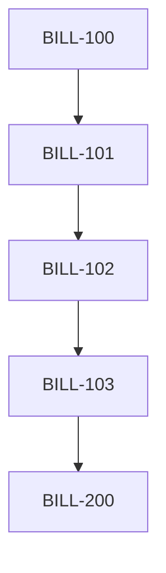
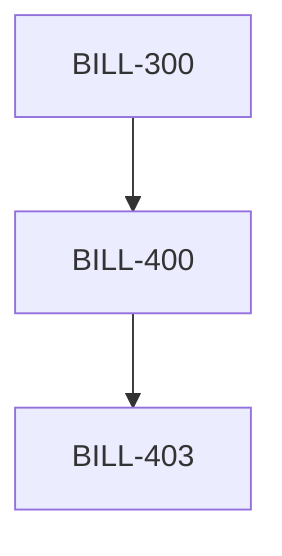

# Billing System Implementation Overview

## Project Structure

The billing system implementation follows the PRD requirements and is organized into five phases:

### Phase 1: Core Infrastructure

-   [BILL-100-P1] Enhanced Database Schema

    -   Core tables for usage, credits, and billing
    -   Support for future organization features
    -   Performance optimized schema
    -   Audit trail capabilities

-   [BILL-101-P1] Stripe Customer Integration

    -   Automatic customer creation
    -   Payment method handling
    -   Customer metadata management
    -   Stripe webhook processing

-   [BILL-102-P1] Usage Meter Setup

    -   Stripe meter configuration
    -   Usage event tracking
    -   Real-time monitoring
    -   Aggregation rules

-   [BILL-103-P1] Integration Testing
    -   End-to-end test suite
    -   API integration tests
    -   Performance validation
    -   Security verification

### Phase 2: Usage Tracking & Blocking

-   [BILL-200-P2] Usage Event Tracking

    -   Real-time event processing
    -   Resource type tracking
    -   Usage aggregation
    -   Monitoring system

-   [BILL-201-P2] Free Tier Management

    -   10,000 free credits
    -   Usage monitoring
    -   Threshold notifications
    -   Upgrade path

-   [BILL-202-P2] Hard Limit Implementation
    -   500,000 credit limit
    -   Blocking mechanism
    -   Override system
    -   Status notifications

### Phase 3: Subscription & Billing

-   [BILL-300-P3] Subscription Management

    -   Credit package configuration ($5/100k)
    -   Subscription lifecycle
    -   Payment integration
    -   Account management UI

-   [BILL-301-P3] Weekly Invoice Generation

    -   Automated generation
    -   Usage calculation
    -   Invoice delivery
    -   Payment processing

-   [BILL-302-P3] Payment Processing

    -   Payment method management
    -   Transaction processing
    -   Error handling
    -   Security measures

-   [BILL-303-P3] Billing Notifications
    -   Invoice notifications
    -   Usage alerts
    -   Payment reminders
    -   Status updates

### Phase 4: Dashboards & Administration

-   [BILL-400-P4] Usage Dashboard

    -   Credit balance display
    -   Usage analytics
    -   Resource monitoring
    -   Export capabilities

-   [BILL-403-P4] Admin Dashboard
    -   User management
    -   System monitoring
    -   Override controls
    -   Reporting tools

### Phase 5: Organization Features

-   [BILL-500-P5] Organization-Level Billing

    -   Organization structure
    -   Billing configuration
    -   Admin controls
    -   Policy management

-   [BILL-501-P5] Credit Pool Management
    -   Shared credit pools
    -   Usage allocation
    -   Member management
    -   Usage reporting

## Critical Paths

### Core Infrastructure Path

### Billing Path

### UI Path

## Implementation Priorities

1. Core Infrastructure

    - Database schema and migrations
    - Stripe integration
    - Usage tracking foundation
    - Testing framework

2. Usage Management

    - Event tracking system
    - Free tier implementation
    - Hard limit controls
    - Real-time monitoring

3. Billing Operations

    - Subscription system
    - Invoice generation
    - Payment processing
    - Notification system

4. User Interface

    - Usage dashboard
    - Admin controls
    - Reporting tools
    - User management

5. Organization Features
    - Organization billing
    - Credit pooling
    - Admin controls
    - Usage reporting

## Success Metrics

### Performance

-   API response time < 100ms
-   UI interactions < 200ms
-   Real-time updates < 1s
-   99.9% uptime

### Reliability

-   Accurate usage tracking
-   Consistent billing
-   No usage leaks
-   Proper blocking

### Security

-   PCI compliance
-   Data encryption
-   Access control
-   Audit logging

## Next Steps

1. Review and finalize Phase 1 specifications
2. Set up development environment
3. Create initial database migrations
4. Configure Stripe test environment
5. Begin implementation of core infrastructure

## Shared Resources

### API Endpoints

-   `/api/billing/usage`
-   `/api/billing/credits`
-   `/api/billing/subscriptions`
-   `/api/billing/invoices`
-   `/api/billing/organizations`

### Database Tables

-   `user_credits`
-   `credit_purchases`
-   `usage_events`
-   `credit_alerts`
-   `organizations`
-   `org_members`

### Stripe Resources

-   Customers
-   Subscriptions
-   Usage Meters
-   Invoices
-   Payment Methods

## Implementation Guidelines

### Code Standards

-   Use TypeScript for all new code
-   Follow React best practices for UI components
-   Implement comprehensive error handling
-   Include unit tests for all features
-   Document all public APIs

### Security Requirements

-   Implement role-based access control
-   Use secure token handling
-   Encrypt sensitive data
-   Maintain audit logs
-   Regular security reviews

### Performance Targets

-   API response time < 100ms
-   UI interactions < 200ms
-   Real-time updates < 1s
-   Page load time < 2s
-   99.9% uptime

### Testing Strategy

-   Unit tests for all components
-   Integration tests for workflows
-   Performance testing under load
-   Security testing
-   User acceptance testing

## Monitoring & Metrics

### Key Performance Indicators

-   Credit usage accuracy
-   Billing cycle completion
-   Payment success rate
-   System response time
-   User satisfaction

### Alert Thresholds

-   Error rate > 1%
-   Response time > 500ms
-   Failed payments > 5%
-   System load > 80%
-   API errors > 0.1%

## Documentation Requirements

### Technical Documentation

-   Architecture diagrams
-   API specifications
-   Database schemas
-   Integration guides
-   Security protocols

### User Documentation

-   User guides
-   Admin manuals
-   API documentation
-   Troubleshooting guides
-   FAQs

## Risk Management

### High-Priority Risks

1. Data consistency between systems
2. Payment processing reliability
3. Usage tracking accuracy
4. System performance under load
5. Security vulnerabilities

### Mitigation Strategies

1. Regular reconciliation
2. Redundant systems
3. Comprehensive testing
4. Performance optimization
5. Security audits
