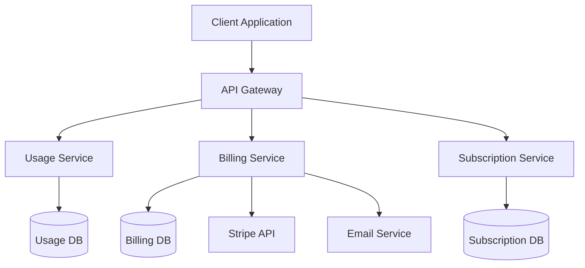

# Billing System Technical Architecture

## System Overview



## Core Components

### 1. Usage Service

-   **Purpose**: Track and manage resource usage across the platform
-   **Key Functions**:
    -   Usage event collection
    -   Real-time usage tracking
    -   Usage aggregation
    -   Free tier management
    -   Hard limit enforcement
-   **Tech Stack**:
    -   Language: Node.js
    -   Database: MongoDB
    -   Message Queue: RabbitMQ

### 2. Billing Service

-   **Purpose**: Handle all billing-related operations
-   **Key Functions**:
    -   Invoice generation
    -   Payment processing
    -   Credit management
    -   Usage cost calculation
    -   Billing notifications
-   **Tech Stack**:
    -   Language: Node.js
    -   Database: PostgreSQL
    -   Payment Gateway: Stripe
    -   Email Service: SendGrid

### 3. Subscription Service

-   **Purpose**: Manage subscription lifecycle and plans
-   **Key Functions**:
    -   Subscription management
    -   Plan configuration
    -   Feature entitlements
    -   Organization billing
    -   Credit pool management
-   **Tech Stack**:
    -   Language: Node.js
    -   Database: PostgreSQL
    -   Cache: Redis

## Database Schema

### Usage DB (MongoDB)

```javascript
// Usage Events
{
  _id: ObjectId,
  userId: String,
  organizationId: String,
  resourceType: String,
  quantity: Number,
  timestamp: Date,
  metadata: Object
}

// Usage Aggregates
{
  _id: ObjectId,
  userId: String,
  organizationId: String,
  resourceType: String,
  totalUsage: Number,
  period: {
    start: Date,
    end: Date
  }
}
```

### Billing DB (PostgreSQL)

```sql
-- Invoices
CREATE TABLE invoices (
  id SERIAL PRIMARY KEY,
  user_id VARCHAR(255),
  organization_id VARCHAR(255),
  amount DECIMAL(10,2),
  status VARCHAR(50),
  due_date DATE,
  paid_date DATE,
  stripe_invoice_id VARCHAR(255)
);

-- Credits
CREATE TABLE credits (
  id SERIAL PRIMARY KEY,
  organization_id VARCHAR(255),
  amount DECIMAL(10,2),
  type VARCHAR(50),
  expiry_date DATE,
  created_at TIMESTAMP
);
```

### Subscription DB (PostgreSQL)

```sql
-- Subscriptions
CREATE TABLE subscriptions (
  id SERIAL PRIMARY KEY,
  user_id VARCHAR(255),
  organization_id VARCHAR(255),
  plan_id VARCHAR(255),
  status VARCHAR(50),
  start_date DATE,
  end_date DATE,
  stripe_subscription_id VARCHAR(255)
);

-- Plans
CREATE TABLE plans (
  id SERIAL PRIMARY KEY,
  name VARCHAR(255),
  description TEXT,
  price DECIMAL(10,2),
  billing_interval VARCHAR(50),
  features JSONB
);
```

## API Endpoints

### Usage API

```
POST /api/v1/usage/events
GET /api/v1/usage/metrics
GET /api/v1/usage/limits
POST /api/v1/usage/validate
```

### Billing API

```
POST /api/v1/billing/invoices
GET /api/v1/billing/invoices
POST /api/v1/billing/payments
GET /api/v1/billing/credits
POST /api/v1/billing/credits/purchase
```

### Subscription API

```
POST /api/v1/subscriptions
GET /api/v1/subscriptions
PUT /api/v1/subscriptions/{id}
GET /api/v1/plans
POST /api/v1/organizations/billing
```

## Security Architecture

### Authentication & Authorization

-   JWT-based authentication
-   Role-based access control (RBAC)
-   Organization-level permissions
-   API key authentication for usage events

### Data Security

-   Encryption at rest
-   TLS for data in transit
-   PCI compliance for payment data
-   Regular security audits

## Monitoring & Observability

### Metrics

-   Usage tracking accuracy
-   Billing success rate
-   API response times
-   Error rates
-   System resource utilization

### Logging

-   Structured JSON logging
-   Centralized log aggregation
-   Audit trail for billing events
-   Error tracking and alerting

### Alerts

-   Usage threshold alerts
-   Billing failure alerts
-   System health alerts
-   Security incident alerts

## Scalability & Performance

### Caching Strategy

-   Redis for frequently accessed data
-   Cache invalidation patterns
-   Cache warming for reports

### Database Optimization

-   Indexing strategy
-   Partitioning for historical data
-   Query optimization
-   Connection pooling

### Load Handling

-   Rate limiting
-   Request queuing
-   Horizontal scaling
-   Load balancing

## Disaster Recovery

### Backup Strategy

-   Daily database backups
-   Transaction log shipping
-   Cross-region replication
-   Point-in-time recovery

### Recovery Procedures

-   Service restoration steps
-   Data consistency checks
-   Communication protocols
-   Rollback procedures

## Integration Points

### External Services

-   Stripe API integration
-   Email service integration
-   Analytics integration
-   Monitoring services

### Internal Services

-   User service integration
-   Resource provisioning
-   Notification system
-   Reporting service

## Development Guidelines

### Code Standards

-   ESLint configuration
-   Code formatting rules
-   Documentation requirements
-   Testing requirements

### Testing Strategy

-   Unit testing
-   Integration testing
-   Load testing
-   Security testing

### Deployment Process

-   CI/CD pipeline
-   Environment promotion
-   Rollback procedures
-   Feature flags

## Future Considerations

### Scalability Improvements

-   Microservices decomposition
-   Event sourcing
-   CQRS pattern
-   Sharding strategy

### Feature Enhancements

-   Multi-currency support
-   Advanced reporting
-   AI-powered insights
-   Custom billing rules

### Technical Debt

-   Schema migrations
-   Legacy system integration
-   Code refactoring
-   Documentation updates
