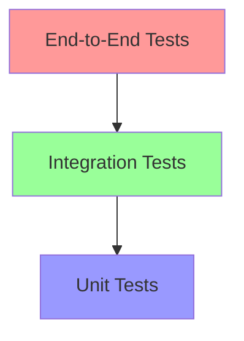
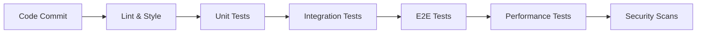

# Billing System Testing Strategy

## Testing Overview

### Testing Pyramid

### Test Distribution

-   Unit Tests: 70%
-   Integration Tests: 20%
-   End-to-End Tests: 10%

## Test Categories

### 1. Unit Tests

#### Coverage Requirements

-   Minimum 80% code coverage
-   100% coverage for critical billing logic
-   All public methods must be tested
-   Edge cases must be covered

#### Test Areas

-   Usage calculation logic
-   Billing rate computation
-   Credit management
-   Invoice generation
-   Payment processing validation
-   Subscription state management

#### Tools & Framework

-   Jest for Node.js
-   Mocha/Chai as alternatives
-   Sinon for mocking
-   NYC for coverage reporting

### 2. Integration Tests

#### Test Scenarios

-   Database operations
-   External API interactions
-   Service communications
-   Message queue operations
-   Cache interactions

#### Key Integrations

-   Stripe API integration
-   Email service integration
-   Database transactions
-   Message queue processing
-   Cache synchronization

#### Tools & Framework

-   Supertest for API testing
-   TestContainers for database testing
-   Mock servers for external services
-   Integration test environment setup

### 3. End-to-End Tests

#### Critical Flows

-   Complete billing cycle
-   Subscription lifecycle
-   Usage tracking and limits
-   Payment processing
-   Organization billing

#### Test Environment

-   Staging environment setup
-   Test data generation
-   External service mocks
-   Monitoring integration

#### Tools & Framework

-   Cypress for UI testing
-   Playwright for browser automation
-   Postman for API testing
-   Custom E2E test runners

## Test Data Management

### Test Data Strategy

-   Synthetic data generation
-   Anonymized production data
-   Test data versioning
-   Data cleanup procedures

### Data Sets

-   Basic usage patterns
-   Complex billing scenarios
-   Edge cases and limits
-   Error conditions
-   Performance test data

## Performance Testing

### Load Testing

-   API endpoint performance
-   Database query performance
-   Concurrent user simulation
-   Resource usage monitoring

### Stress Testing

-   System capacity limits
-   Error handling under load
-   Recovery testing
-   Resource exhaustion scenarios

### Tools

-   Apache JMeter
-   K6 for API load testing
-   Custom performance scripts
-   Monitoring integration

## Security Testing

### Security Scans

-   OWASP compliance
-   Vulnerability scanning
-   Dependency checks
-   Code security analysis

### Penetration Testing

-   Authentication testing
-   Authorization testing
-   API security testing
-   Data encryption validation

### Compliance Testing

-   PCI compliance
-   GDPR requirements
-   Data privacy
-   Audit trail validation

## Test Automation

### CI/CD Integration

-   Automated test runs
-   Test environment setup
-   Results reporting
-   Coverage tracking

### Test Pipeline

### Automation Framework

-   Test script organization
-   Common utilities
-   Test data management
-   Reporting integration

## Test Monitoring

### Metrics Tracking

-   Test execution time
-   Pass/fail rates
-   Coverage trends
-   Performance metrics

### Reporting

-   Test result dashboards
-   Coverage reports
-   Performance reports
-   Security scan reports

### Alert Configuration

-   Test failure notifications
-   Coverage drop alerts
-   Performance degradation
-   Security vulnerabilities

## Test Environment Management

### Environment Setup

-   Development environment
-   Testing environment
-   Staging environment
-   Production mirror

### Configuration Management

-   Environment variables
-   Service configurations
-   Test data setup
-   External service mocks

### Maintenance

-   Environment refresh
-   Data cleanup
-   Configuration updates
-   Dependency management

## Quality Gates

### Code Quality

-   Linting rules
-   Code style checks
-   Complexity metrics
-   Documentation requirements

### Test Quality

-   Coverage thresholds
-   Performance benchmarks
-   Security requirements
-   Compliance checks

### Release Criteria

-   All tests passing
-   Coverage requirements met
-   Performance targets achieved
-   Security clearance

## Continuous Improvement

### Process Review

-   Regular test reviews
-   Coverage analysis
-   Performance trending
-   Security assessments

### Documentation

-   Test documentation
-   Setup guides
-   Troubleshooting guides
-   Best practices

### Training

-   Team training
-   Tool workshops
-   Testing guidelines
-   Security awareness

## Risk Mitigation

### Test Risks

-   Flaky tests handling
-   External dependency management
-   Test data consistency
-   Environment stability

### Mitigation Strategies

-   Retry mechanisms
-   Mock services
-   Data versioning
-   Environment monitoring

### Contingency Plans

-   Test failure handling
-   Environment recovery
-   Data backup/restore
-   Communication plan

## Appendix

### Test Templates

-   Unit test templates
-   Integration test templates
-   E2E test templates
-   Performance test templates

### Checklists

-   Test review checklist
-   Release testing checklist
-   Security testing checklist
-   Environment setup checklist

### Reference Documents

-   Testing standards
-   Tool documentation
-   Best practices guide
-   Troubleshooting guide
