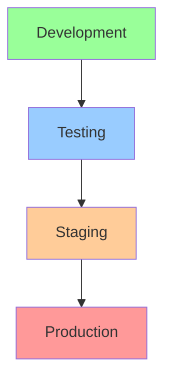
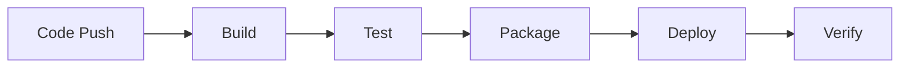

# Billing System Deployment Guide

## Deployment Overview

### Environment Structure



## Pre-Deployment Requirements

### Infrastructure Setup

-   Cloud provider configuration
-   Network configuration
-   Security groups
-   Load balancers
-   Database clusters
-   Message queues
-   Caching layers

### Dependencies

-   Node.js runtime
-   MongoDB
-   PostgreSQL
-   Redis
-   RabbitMQ
-   Stripe API access
-   SendGrid configuration

### Security Requirements

-   SSL certificates
-   API keys
-   Environment secrets
-   Access credentials
-   Security policies

## Deployment Process

### 1. Environment Preparation

#### Configuration Management

```yaml
# config.yaml example
environment:
    name: production
    region: us-east-1

database:
    host: db.example.com
    port: 5432
    name: billing_db

services:
    stripe:
        api_key: ${STRIPE_API_KEY}
        webhook_secret: ${STRIPE_WEBHOOK_SECRET}

monitoring:
    datadog_api_key: ${DD_API_KEY}
    log_level: info
```

#### Secret Management

-   Vault integration
-   Environment variables
-   Secret rotation
-   Access control

### 2. Database Migration

#### Migration Steps

1. Backup existing database
2. Run schema migrations
3. Validate data integrity
4. Update indexes
5. Verify performance

#### Rollback Plan

-   Backup restoration
-   Schema rollback
-   Data verification
-   Service recovery

### 3. Service Deployment

#### Deployment Sequence

1. Update configuration
2. Deploy database changes
3. Deploy backend services
4. Update frontend assets
5. Configure load balancers
6. Enable monitoring

#### Health Checks

-   Database connectivity
-   API endpoints
-   External services
-   Cache synchronization
-   Message queues

### 4. Post-Deployment Verification

#### Service Validation

-   API health checks
-   Database queries
-   Cache operations
-   Message processing
-   External integrations

#### Performance Validation

-   Response times
-   Resource usage
-   Error rates
-   Throughput metrics

## Deployment Automation

### CI/CD Pipeline



### Automation Tools

-   GitHub Actions
-   Jenkins
-   Docker
-   Kubernetes
-   Terraform
-   Ansible

### Deployment Scripts

```bash
#!/bin/bash
# deployment.sh example

# Pre-deployment checks
check_dependencies() {
    echo "Checking dependencies..."
    command -v node >/dev/null 2>&1 || { echo "Node.js is required but not installed." >&2; exit 1; }
    command -v docker >/dev/null 2>&1 || { echo "Docker is required but not installed." >&2; exit 1; }
}

# Database migration
run_migrations() {
    echo "Running database migrations..."
    npm run migrate
}

# Service deployment
deploy_services() {
    echo "Deploying services..."
    docker-compose up -d
}

# Main deployment sequence
main() {
    check_dependencies
    run_migrations
    deploy_services
}

main "$@"
```

## Monitoring & Alerting

### Monitoring Setup

-   Metrics collection
-   Log aggregation
-   Performance monitoring
-   Error tracking
-   User activity

### Alert Configuration

-   Service health
-   Performance thresholds
-   Error rates
-   Security incidents
-   Business metrics

## Rollback Procedures

### Rollback Triggers

-   Service failures
-   Data corruption
-   Performance issues
-   Security incidents
-   Business requirements

### Rollback Steps

1. Stop incoming traffic
2. Restore previous version
3. Rollback database
4. Verify services
5. Resume traffic

## Disaster Recovery

### Backup Strategy

-   Database backups
-   Configuration backups
-   Code versioning
-   Documentation

### Recovery Procedures

1. Assess incident
2. Initiate recovery
3. Restore services
4. Verify functionality
5. Resume operations

## Security Measures

### Access Control

-   Role-based access
-   API authentication
-   Network security
-   Audit logging

### Compliance

-   PCI compliance
-   GDPR requirements
-   Security scanning
-   Vulnerability testing

## Performance Optimization

### Caching Strategy

-   Redis configuration
-   Cache invalidation
-   Cache warming
-   Performance monitoring

### Database Optimization

-   Query optimization
-   Index management
-   Connection pooling
-   Resource allocation

## Documentation

### Deployment Documentation

-   Setup guides
-   Configuration reference
-   Troubleshooting guide
-   Recovery procedures

### Runbooks

-   Deployment procedures
-   Rollback procedures
-   Incident response
-   Maintenance tasks

## Maintenance Procedures

### Regular Maintenance

-   Security updates
-   Dependency updates
-   Performance tuning
-   Log rotation

### Emergency Maintenance

-   Critical patches
-   Security fixes
-   Performance issues
-   Data recovery

## Appendix

### Deployment Checklist

-   Pre-deployment tasks
-   Deployment steps
-   Verification tasks
-   Documentation updates

### Configuration Templates

-   Environment configs
-   Service configs
-   Monitoring configs
-   Security policies

### Contact Information

-   Team contacts
-   Support channels
-   Emergency contacts
-   Vendor support

### Reference Documents

-   Architecture diagrams
-   Network diagrams
-   Security policies
-   Compliance requirements
