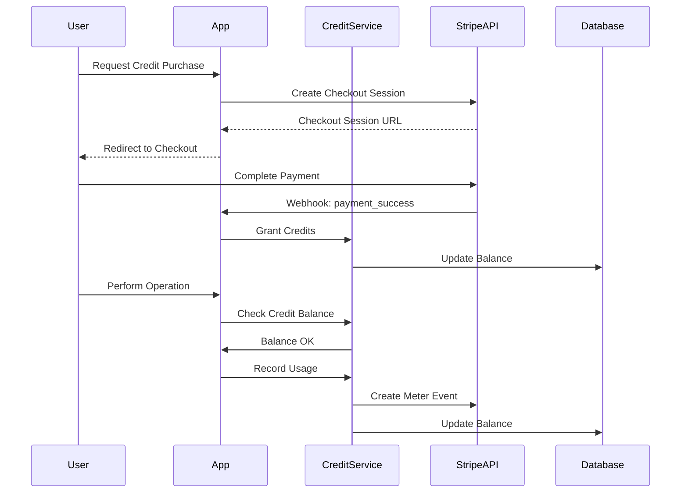

# Usage Billing System PRD (Revised for MVP)

## Overview

The Usage Billing System is a **simplified** but comprehensive solution for **tracking, measuring, and billing usage** of AI resources in the Flowise platform. Its purpose is to replace the current Langfuse-based tracking with direct or near-real-time usage tracking in our own databases, while maintaining compatibility with Stripe for payment processing.

This updated PRD reflects the **latest stakeholder guidance** and the **billing tickets** (BILL-001 to BILL-005), focusing on a lean MVP with minimal scope. The system will track **AI tokens** and **compute** usage initially, with **storage metrics** deferred until a future release.

---

## Goals

1. **Implement a Credit-Based System**

    - Track usage in virtual coins (credits)
    - Free allocation of 10,000 credits
    - Automatic customer creation in Stripe
    - Hard limit of 500,000 credits
    - Blocking mechanism at credit thresholds

2. **Credit Purchase System**

    - Subscription-based credit purchases ($5 per 100,000 credits)
    - Payment method required after free credits exhausted
    - Weekly invoice generation
    - No automatic overages beyond 500,000 credits
    - Dashboard metrics from Stripe event summaries

3. **Usage Tracking & Alerts**

    - Real-time tracking via Stripe meter events
    - Automatic customer creation on first usage
    - Blocking at 10,000 (free tier) and 500,000 (hard limit)
    - Usage history and projections from Stripe

4. **Stripe Integration**

    - Automatic customer creation
    - Metering API for usage tracking
    - Weekly invoice generation
    - Dashboard metrics from event summaries

5. **Plan for Future Enhancements**
    - Organization-level credit pooling
    - Overage pricing beyond 500,000 credits
    - Bulk credit discounts
    - Credit expiration policies

---

## Current System Analysis

### Existing Components

-   **Langfuse (to be replaced/improved)**: External usage tracking service.
-   **Stripe**: Payment gateway and subscription management.
-   **Sparks-based Pricing Model**: Currently references AI tokens, compute, and (optionally) storage.
-   **Usage Metrics**: AI tokens, compute usage, basic metadata.

### Pain Points

-   Over-dependency on an external service (Langfuse).
-   Additional latency from external API calls.
-   Limited custom logic for usage blocking.
-   Risk of uncollectible overage debt.

---

## Technical Requirements

### 1. Database Schema

> **Note:** Storage usage is out of scope for MVP. These tables retain placeholders for future expansions.

```sql
CREATE TABLE user_credits (
    id UUID PRIMARY KEY,
    user_id UUID NOT NULL,
    organization_id UUID,
    stripe_customer_id VARCHAR(255) NOT NULL,
    free_credits_balance INTEGER NOT NULL DEFAULT 10000,
    purchased_credits_balance INTEGER NOT NULL DEFAULT 0,
    is_blocked BOOLEAN NOT NULL DEFAULT FALSE,
    block_reason VARCHAR(50),
    last_invoice_at TIMESTAMP,
    created_at TIMESTAMP DEFAULT CURRENT_TIMESTAMP,
    updated_at TIMESTAMP DEFAULT CURRENT_TIMESTAMP
);

CREATE TABLE credit_purchases (
    id UUID PRIMARY KEY,
    user_id UUID NOT NULL,
    organization_id UUID,
    stripe_customer_id VARCHAR(255) NOT NULL,
    subscription_id VARCHAR(255),
    amount_usd NUMERIC(10,2) NOT NULL,
    credits_granted INTEGER NOT NULL,
    status VARCHAR(50) NOT NULL,
    created_at TIMESTAMP DEFAULT CURRENT_TIMESTAMP
);

CREATE TABLE usage_events (
    id UUID PRIMARY KEY,
    user_id UUID NOT NULL,
    organization_id UUID,
    stripe_customer_id VARCHAR(255) NOT NULL,
    credits_used INTEGER NOT NULL,
    type VARCHAR(50) NOT NULL,
    stripe_meter_event_id VARCHAR(255),
    metadata JSONB,
    created_at TIMESTAMP DEFAULT CURRENT_TIMESTAMP
);

CREATE TABLE credit_alerts (
    id UUID PRIMARY KEY,
    user_id UUID NOT NULL,
    organization_id UUID,
    stripe_customer_id VARCHAR(255) NOT NULL,
    type VARCHAR(50) NOT NULL,
    threshold INTEGER NOT NULL,
    triggered_at TIMESTAMP DEFAULT CURRENT_TIMESTAMP,
    acknowledged_at TIMESTAMP
);
```

### 2. Customer Lifecycle

1. **Initial Creation**

    - User created in system
    - Automatic Stripe customer creation
    - Initial 10,000 free credits granted
    - No payment method required

2. **Free Tier Usage**

    - Usage tracked via Stripe meters
    - Blocking at 10,000 credits
    - Payment method required to continue
    - Weekly usage summaries generated

3. **Paid Tier Transition**

    - Payment method added
    - Subscription created ($5 per 100k credits)
    - Blocking removed
    - Weekly invoices begin

4. **Usage Limits**
    - Hard block at 500,000 credits
    - No automatic overages
    - Manual intervention required
    - Usage summaries continue

### 3. Blocking Mechanism

```typescript
enum BlockReason {
    FREE_TIER_EXCEEDED = 'free_tier_exceeded',
    HARD_LIMIT_REACHED = 'hard_limit_reached',
    PAYMENT_REQUIRED = 'payment_required',
    SUBSCRIPTION_INACTIVE = 'subscription_inactive'
}

interface BlockingConfig {
    FREE_TIER_LIMIT: 10000
    HARD_LIMIT: 500000
    GRACE_PERIOD_HOURS: 24
    CHECK_FREQUENCY_MINUTES: 5
}

interface BlockingResponse {
    isBlocked: boolean
    reason?: BlockReason
    requiredAction?: string
    currentUsage: number
    limit: number
}
```

### 2. Callback Handler Interface

```typescript
interface UsageCallbackHandler {
    // Lifecycle Methods
    onTraceStart(name: string, metadata: object): Promise<string> // Returns traceId
    onTraceEnd(traceId: string, output: any): Promise<void>

    // Chain Tracking
    onChainStart(chain: any, inputs: any, runId: string, parentRunId?: string): Promise<void>
    onChainEnd(outputs: any, runId: string): Promise<void>
    onChainError(error: Error, runId: string): Promise<void>

    // LLM Tracking
    onLLMStart(llm: any, prompts: string[], runId: string, parentRunId?: string): Promise<void>
    onLLMEnd(output: any, runId: string): Promise<void>
    onLLMError(error: Error, runId: string): Promise<void>

    // Token Streaming
    onTokenStream(token: string, runId: string): Promise<void>

    // Usage Metrics
    recordUsage(metrics: UsageMetrics): Promise<void>
}

interface UsageMetrics {
    traceId: string
    spanId: string
    metricType: 'ai_tokens' | 'compute' // 'storage' is deferred for MVP
    value: number
    unit: string
    timestamp: Date
    metadata?: object
}
```

### 3. Pricing Configuration

> **MVP focus on AI tokens and compute**; storage is a future phase.

```typescript
const BILLING_CONFIG = {
    FREE_CREDITS: 10000,
    PAID_TIER: {
        PRICE_USD: 5,
        CREDITS: 100000
    },
    HARD_LIMIT: 500000,
    INVOICE_FREQUENCY: 'weekly',

    RATES: {
        AI_TOKENS: {
            UNIT: 1000, // 1,000 tokens
            CREDITS: 100 // 100 credits per 1,000 tokens
        },
        COMPUTE: {
            UNIT: 1, // 1 minute
            CREDITS: 50 // 50 credits per minute
        }
    }
}
```

### 2. Credit Purchase Configuration

```typescript
const CREDIT_CONFIG = {
    FREE_CREDITS_MONTHLY: 10000,
    USD_TO_CREDITS_RATIO: 1000, // 1 USD = 1000 credits
    MINIMUM_PURCHASE_USD: 5,
    ALERT_THRESHOLDS: {
        LOW_BALANCE: 1000,
        CRITICAL_BALANCE: 100
    },
    PURCHASE_TIERS: [
        { amount_usd: 5, bonus_credits: 0 },
        { amount_usd: 20, bonus_credits: 1000 },
        { amount_usd: 50, bonus_credits: 3000 }
    ]
}

interface CreditPurchase {
    amount_usd: number
    credits_granted: number
    user_id: string
    organization_id?: string
    payment_method_id?: string
}

interface CreditBalance {
    free_credits: number
    purchased_credits: number
    total_available: number
    next_reset_date: Date
}
```

---

## Features

### 1. Usage Tracking

-   **Real-time credit ledger**: Track AI tokens and compute usage immediately.
-   **Deferred or partial usage logging**: Placeholders for storage, but not active in MVP.
-   **Detailed trace and span recording** via integrated callback handlers.
-   **Error Handling**: Proper chain error tracking inside usage metrics.

### 2. Billing Integration

-   **Stripe Subscriptions**: A free tier and a single paid tier.
-   **Overage Handling**: If a user exceeds the monthly paid tier allotment, they can be billed for usage beyond the threshold.
-   **Usage Blocking**: Automatic request blocking once a user hits or exceeds their monthly credit limit, preventing runaway bills.

### 3. Reporting

-   **Real-time usage statistics**: Each user can see how many credits remain.
-   **Cost analysis** with partial support for overage data.
-   **Usage breakdown** for AI token vs. compute usage.
-   **Export capability**: Basic CSV/JSON downloads of usage data.

### 4. Monitoring & Alerts

-   **Preemptive Alerts**: 80% and 95% usage thresholds for monthly credits.
-   **Over-limit Blocking**: Hard block once credits are fully consumed, requiring an upgrade or purchase of additional credits.
-   **Performance metrics** (latency, error rates) remain culturally similar to previous design.

---

## Implementation Phases

### Phase 1: Core Infrastructure (Week 1)

-   **Database Schema** for user credits, purchases, usage events, and alerts
-   **Stripe Customer Integration**:
    -   Automatic customer creation
    -   Initial meter setup
    -   Basic usage tracking
-   **Basic Unit Tests** for customer creation and usage tracking
-   **Stripe Integration** for customer and meter management

### Phase 2: Usage Tracking & Blocking (Week 2)

-   **Credit Management System**:
    -   Free tier tracking (10,000 limit)
    -   Usage aggregation from Stripe
    -   Blocking mechanism implementation
-   **Real-time Usage Tracking**:
    -   Stripe meter integration
    -   Usage event logging
    -   Balance checking middleware
-   **Blocking System**:
    -   Free tier limit (10,000)
    -   Hard limit (500,000)
    -   Payment requirement triggers

### Phase 3: Subscription & Billing (Week 3)

-   **Credit Purchase Flow**:
    -   Stripe Checkout integration
    -   Subscription management ($5 per 100k)
    -   Weekly invoice generation
-   **Payment Processing**:
    -   Payment method collection
    -   Subscription activation
    -   Invoice generation

### Phase 4: UI & Reporting (Week 4)

-   **Credit Management UI**:
    -   Usage dashboard from Stripe
    -   Purchase credit flow
    -   Blocking status display
-   **Admin Dashboard**:
    -   Usage analytics
    -   Customer management
    -   Blocking management

### Phase 5: Organization Billing (Deferred)

-   Organization-level billing
-   Credit pooling
-   Advanced marketplace features
-   Storage usage tracking

#### Free Tier Implementation

The free tier provides:

-   10,000 credits monthly allocation
-   Automatic reset on billing cycle
-   Usage tracking without payment method
-   Clear upgrade path when credits low

#### Credit Purchase Flow

1. **User Journey**:

    - View current credit balance
    - Select credit purchase amount
    - Complete Stripe Checkout
    - Immediate credit grant
    - Receipt/invoice generation

2. **Technical Flow**:

```typescript
interface CreditPurchaseFlow {
    // Check current balance
    checkBalance(): Promise<CreditBalance>

    // Initiate purchase
    createPurchase(amount_usd: number): Promise<CreditPurchase>

    // Process Stripe payment
    processPayment(purchase_id: string, payment_method_id: string): Promise<void>

    // Grant credits
    grantCredits(purchase_id: string): Promise<void>

    // Generate receipt
    generateReceipt(purchase_id: string): Promise<string>
}
```

3. **Error Handling**:
    - Failed payments
    - Credit grant failures
    - Balance synchronization issues
    - Duplicate purchase prevention

#### Credit Balance Monitoring

1. **Real-time Tracking**:

```typescript
interface CreditMonitoring {
    // Check if operation can proceed
    canProcessOperation(credits_needed: number): Promise<boolean>

    // Record usage
    recordUsage(credits_used: number): Promise<void>

    // Check alert thresholds
    checkAlertThresholds(): Promise<CreditAlert[]>

    // Project usage trends
    projectCreditUsage(): Promise<CreditProjection>
}
```

2. **Alert Thresholds**:
    - 80% of free credits used
    - 95% of free credits used
    - Low purchased credits
    - Unusual usage patterns

### Phase 5: Organization Billing (Deferred)

-   Implement organization-level billing, pooling credits at the org level.
-   Track usage individually but consolidate bills.
-   Provide admin views for organizations.
-   Ensure minimal disruption to existing user-level logic.

#### Organization Usage Soft Limit (Future)

To address potential runaways in multi-deployment org usage,
consider a "warning threshold" at some fraction of the monthly org
allotment. Once triggered, the system:

-   Notifies org admins (via email/Slack).
-   Suggests adding more credits or halting new usage.

Org usage is processed in each separate deployment environment.
A centralized aggregator must reconcile usage before final invoice
generation, preventing partial or duplicated charges.

---

## Success Metrics

1. **Performance**

    - Maintain sub-50ms latency for usage tracking.
    - 99.9% uptime on billing endpoints.
    - No significant performance regressions from removing Langfuse dependency.

2. **Reliability**

    - Accurate usage tracking for both AI tokens and compute.
    - Consistent monthly invoice calculations.
    - Minimal usage "leaks" or unbilled usage.

3. **Scalability**
    - Support 1,000+ concurrent users.
    - Handle 10,000+ events per second at scale.
    - Efficient database indexing and queries (e.g., usage_metrics timestamps).

---

## Migration Plan

1. **Preparation**

    - Deploy new database schema.
    - Set up monitoring and logging.
    - Establish data backup procedures.

2. **Testing**

    - **Shadow testing**: Compare new usage logs with old Langfuse logs to ensure parity.
    - **Performance Testing**: Load tests on the new usage endpoints.
    - **Integration Tests**: Payment flows with Stripe for free, paid, and overage scenarios.

3. **Rollout**
    - **Gradual migration**: Migrate segments of users to the new system.
    - **Monitoring**: Confirm correctness of usage data and blocking logic.
    - **Rollback**: In case of major billing anomalies, fallback to the old system (if still operational).

---

## Monitoring & Maintenance

### Monitoring

-   **Credit Balances**: Real-time checks of user credit statuses.
-   **System Health**: Latency, error rates, throughput metrics.
-   **Billing Accuracy**: Alert on abnormal spikes in usage or unusual billing amounts.

### Maintenance

-   **Data Cleanup**: Regularly archive or compress trace data.
-   **Performance Tuning**: Index usage_metrics on trace_id, timestamp.
-   **Security Updates**: Keep dependencies and internal tooling updated.

### Credit Payment Reconciliation

Include a nightly job that reconciles credit usage between the
system's real-time ledger and Stripe's recorded meter usage.
If discrepancies exceed a small threshold (e.g., 2%), flag them
for manual investigation to ensure no incorrectly billed totals.

### Email / Notification Logic

-   Daily usage summaries optional for heavy users.
-   Immediate "near-limit" alerts to minimize unexpected blocks.
-   Admin escalation path if blocks persist unresolved after 24 hours.

---

## Security Considerations

1. **Data Protection**

    - Encrypt usage and billing data at rest.
    - Validate inbound requests from the usage tracking callback.
    - Restrict database access by roles.

2. **Compliance**
    - GDPR best practices around user data.
    - Data retention policies for usage logs.
    - Clear privacy notifications regarding usage tracking.

---

## Future Enhancements

1. **Advanced Analytics**

    - AI-based usage predictions and cost optimizations.
    - Custom query capabilities on usage data.

2. **Marketplace & Sharing**

    - Enhanced logic for "chatbot creators" vs. external usage.
    - Potential for usage-credit "kickbacks" if others use your public flows.
    - Integration with expanded credit systems.

3. **Organization-Level Billing**

    - Full multi-tenant billing with pooled credits.
    - User-level usage caps set by org admins.

4. **Storage Metrics**
    - Expand the usage metrics to track storage usage once the MVP is stable.
    - Integrate cost calculations for storage in the same credits ledger.

---

## Stripe Integration Details

### 1. Credit Purchase Configuration

```typescript
interface CreditPurchaseConfig {
    USD_TO_CREDITS: {
        RATIO: number // e.g., 1000 credits per USD
        MIN_PURCHASE: number // Minimum USD purchase amount
        BONUS_TIERS: {
            [key: number]: number // USD amount to bonus credits mapping
        }
    }
    STRIPE: {
        CHECKOUT_SUCCESS_URL: string
        CHECKOUT_CANCEL_URL: string
        PAYMENT_METHODS: string[]
    }
}

const CREDIT_PURCHASE_CONFIG: CreditPurchaseConfig = {
    USD_TO_CREDITS: {
        RATIO: 1000,
        MIN_PURCHASE: 5,
        BONUS_TIERS: {
            20: 1000, // $20 purchase gets 1000 bonus credits
            50: 3000, // $50 purchase gets 3000 bonus credits
            100: 7000 // $100 purchase gets 7000 bonus credits
        }
    },
    STRIPE: {
        CHECKOUT_SUCCESS_URL: '/dashboard/credits/success',
        CHECKOUT_CANCEL_URL: '/dashboard/credits/cancel',
        PAYMENT_METHODS: ['card']
    }
}
```

### 2. Usage Metering Configuration

```typescript
interface UsageMeterEvent {
    user_id: string
    organization_id?: string
    credits_used: number
    operation_type: string
    metadata: {
        trace_id: string
        timestamp: string
        details: any
    }
}

const USAGE_METER_CONFIG = {
    METER_ID: 'mtr_credits_usage',
    AGGREGATION_MODE: 'sum',
    REPORTING_INTERVAL: 'hour',
    THRESHOLDS: {
        LOW_BALANCE: 1000,
        CRITICAL: 100
    }
}
```

### 3. Integration Flow



### 4. Credit Purchase Implementation

```typescript
class CreditPurchaseService {
    async createPurchase(userId: string, amountUsd: number): Promise<string> {
        // Calculate credits including bonuses
        const baseCredits = amountUsd * CREDIT_PURCHASE_CONFIG.USD_TO_CREDITS.RATIO
        const bonusCredits = this.calculateBonusCredits(amountUsd)

        // Create Stripe Checkout session
        const session = await stripe.checkout.sessions.create({
            mode: 'payment',
            payment_method_types: CREDIT_PURCHASE_CONFIG.STRIPE.PAYMENT_METHODS,
            line_items: [
                {
                    price_data: {
                        currency: 'usd',
                        product_data: {
                            name: 'Credit Purchase',
                            description: `${baseCredits + bonusCredits} credits`
                        },
                        unit_amount: amountUsd * 100
                    },
                    quantity: 1
                }
            ],
            metadata: {
                userId,
                baseCredits,
                bonusCredits
            },
            success_url: CREDIT_PURCHASE_CONFIG.STRIPE.CHECKOUT_SUCCESS_URL,
            cancel_url: CREDIT_PURCHASE_CONFIG.STRIPE.CANCEL_URL
        })

        return session.id
    }

    private calculateBonusCredits(amountUsd: number): number {
        const tiers = Object.entries(CREDIT_PURCHASE_CONFIG.USD_TO_CREDITS.BONUS_TIERS).sort(([a], [b]) => Number(b) - Number(a))

        for (const [tierAmount, bonusCredits] of tiers) {
            if (amountUsd >= Number(tierAmount)) {
                return bonusCredits
            }
        }
        return 0
    }
}
```

### 5. Usage Tracking Implementation

```typescript
class CreditUsageService {
    async trackUsage(event: UsageMeterEvent): Promise<void> {
        // Record usage in local database
        await this.recordLocalUsage(event)

        // Send usage event to Stripe
        await stripe.meterEvents.create({
            meter: USAGE_METER_CONFIG.METER_ID,
            value: event.credits_used,
            timestamp: event.metadata.timestamp,
            metadata: {
                user_id: event.user_id,
                organization_id: event.organization_id,
                operation_type: event.operation_type,
                trace_id: event.metadata.trace_id
            }
        })

        // Check balance and trigger alerts if needed
        await this.checkBalanceAndAlert(event.user_id)
    }

    private async checkBalanceAndAlert(userId: string): Promise<void> {
        const balance = await this.getCreditBalance(userId)

        if (balance <= USAGE_METER_CONFIG.THRESHOLDS.CRITICAL) {
            await this.triggerCriticalAlert(userId, balance)
        } else if (balance <= USAGE_METER_CONFIG.THRESHOLDS.LOW_BALANCE) {
            await this.triggerLowBalanceAlert(userId, balance)
        }
    }
}
```

---

## Enhanced Error Handling

### Meter Event Errors

```typescript
interface MeterEventError {
    traceId: string
    error: string
    timestamp: Date
    retryCount: number
    status: 'failed' | 'retrying' | 'resolved'
}

const errorHandlingStrategy = {
    maxRetries: 3,
    retryDelay: 1000,
    fallbackOptions: {
        useDefaultCustomer: true,
        skipFailedEvents: false
    }
}
```

### Recovery Procedures

1. **Customer Not Found**

    - Fallback to default customer logic.
    - Alert system for reconciliation.

2. **Failed Meter Events**

    - Automatic retry with exponential backoff.
    - Dead letter queue for manual review.
    - Notify engineering if failures persist.

3. **Sync Failures**
    - Transaction rollback.
    - Automatic or manual reconciliation.
    - Strict auditing and logging.

---

## Performance Optimization

### Batch Processing Configuration

```typescript
const BATCH_CONFIG = {
    SIZE: 15,
    DELAY: 1000,
    MAX_CONCURRENT: 5,
    TIMEOUT: 30000
}
```

### Caching Strategy

-   Cache meter configurations.
-   Cache subscription details for quick lookups.
-   Validate user credit limits in memory to speed up blocking logic if needed.

### Database Optimization

```sql
-- Indexes for performance
CREATE INDEX idx_usage_metrics_trace_id ON usage_metrics(trace_id);
CREATE INDEX idx_usage_metrics_timestamp ON usage_metrics(timestamp);
CREATE INDEX idx_billing_events_status ON billing_events(status);
CREATE INDEX idx_billing_events_created_at ON billing_events(created_at);
```

---

## Monitoring & Alerts

### Key Metrics

```typescript
interface BillingMetrics {
    meterEventLatency: number
    syncSuccess: number
    syncFailure: number
    batchSize: number
    processingTime: number
    retryCount: number
    errorRate: number
}
```

### Alert Thresholds

-   **Error Rate > 5%**
-   **Sync Latency > 1000ms**
-   **Batch Processing Time > 30s**
-   **Failed Retries > 3**
-   **Customer Not Found** at any frequency > 1%

---

## Conclusion

This revised PRD aims to **deliver a functional MVP** for usage-based billing on AI tokens and compute while **deprioritizing storage** and advanced organizational features. By following this phased approach, Flowise will **streamline** user onboarding with a free tier, ensure **accurate metering** for paid users, and maintain **flexibility** for future expansions. The final system should **reduce external dependencies**, **improve performance**, and **align closely** with Stripe's native subscription and overage capabilities.
