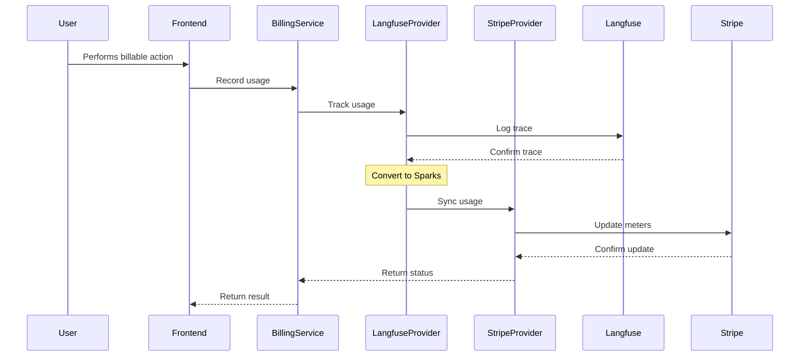
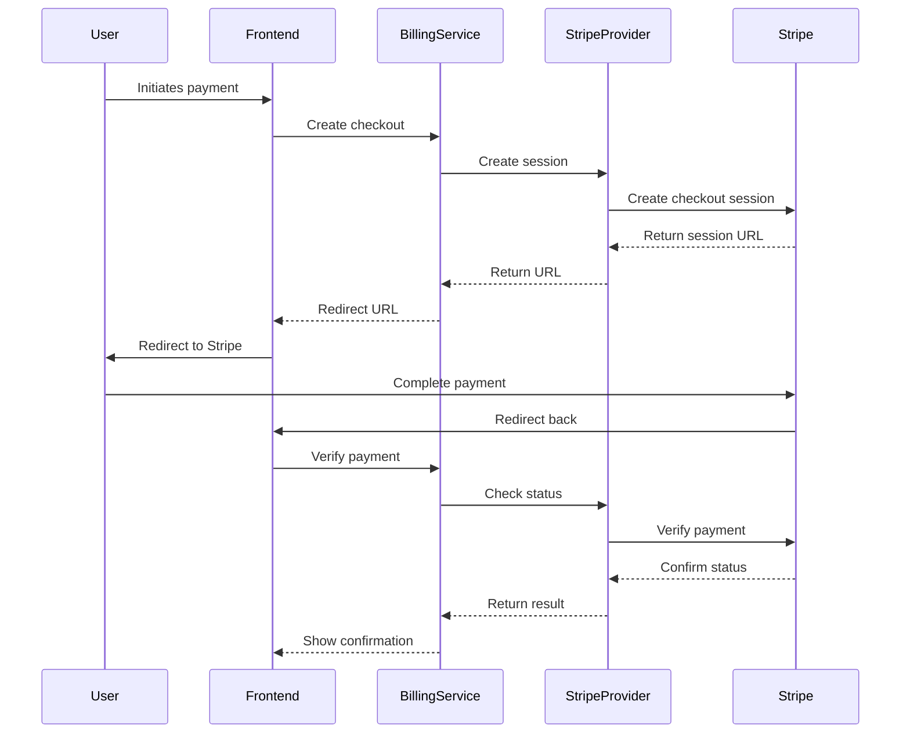

# Flowise Billing System Documentation

## Overview

The Flowise billing system implements a sophisticated hybrid billing model that combines subscription-based and usage-based billing using Stripe as the payment processor. The system is designed to handle both trial and paid plans, with support for organization-level billing and individual user billing.

## Core Components

### 1. Billing Service Architecture

The billing system is composed of several key components:

#### Backend Components

-   `packages/server/src/services/billing/index.ts`: Core billing service
-   `packages/server/src/services/billing/plans.ts`: Plan management
-   `packages/server/src/aai-utils/billing/stripe/StripeProvider.ts`: Stripe integration
-   `packages/server/src/aai-utils/billing/core/BillingService.ts`: Core billing logic

#### Frontend Components

-   `packages-answers/ui/src/billing/BillingDashboard.tsx`: Main billing interface
-   `packages-answers/ui/src/billing/PurchaseSubscription.tsx`: Subscription management
-   `packages-answers/ui/src/billing/UsageStats.tsx`: Usage tracking
-   `packages-answers/ui/src/billing/CostCalculator.tsx`: Cost estimation
-   `packages-answers/ui/src/billing/PurchaseSparks.tsx`: Credit purchase interface

### 2. Billing Models

#### Subscription Plans

```typescript
const SUBSCRIPTION_TIERS = {
    FREE: {
        name: 'Free',
        sparksPerMonth: 10000,
        price: 0,
        priceId: 'price_free',
        features: [
            '10,000 Sparks',
            'Access to GPT-4o mini',
            'Standard voice chats',
            'Limited access to GPT-4o',
            'Basic compute and storage allocation',
            'Community support'
        ]
    },
    PLUS: {
        name: 'Plus',
        sparksPerMonth: 500000,
        price: 20,
        priceId: 'price_1QdEegFeRAHyP6by6yTOvbwj',
        features: [
            '500,000 Sparks per month',
            'Full API access',
            'Extended compute and storage limits',
            'Access to advanced voice and video inputs',
            'Priority support',
            'Create and use custom GPTs',
            'Early access to new features'
        ]
    }
}
```

#### Usage-Based Billing (Sparks)

```typescript
const BILLING_CONFIG = {
    SPARK_TO_USD: 0.001, // 1 Spark = $0.001 USD
    RATES: {
        AI_TOKENS: {
            UNIT: 1000,
            SPARKS: 100,
            COST: 0.1
        },
        COMPUTE: {
            UNIT: 1, // minutes
            SPARKS: 50,
            COST: 0.05
        },
        STORAGE: {
            UNIT: 1, // GB per month
            SPARKS: 500,
            COST: 0.5
        }
    }
}
```

### 3. Usage Tracking

The system tracks usage across three main dimensions:

1. AI Token Consumption
2. Compute Resources
3. Storage Usage

Usage is tracked in real-time and aggregated daily for billing purposes. The system supports:

-   Per-user tracking for trial plans
-   Organization-level tracking for paid plans
-   Real-time usage monitoring
-   Automatic plan transitions based on usage

### 4. API Endpoints

#### Plan Management

-   `GET /billing/plans/current`: Retrieve current plan details
-   `GET /billing/plans/history`: Get plan usage history
-   `POST /billing/plans/check-executions`: Validate available executions

#### Subscription Management

-   `POST /billing/subscriptions`: Create new subscription
-   `PUT /billing/subscriptions/:id`: Update existing subscription
-   `DELETE /billing/subscriptions/:id`: Cancel subscription

#### Billing Portal

-   `POST /billing/portal-sessions`: Create Stripe billing portal session

### 5. Security & Best Practices

#### Security Measures

-   Organization-based access control
-   Secure API key management
-   Transaction-based usage tracking
-   Environment-based configuration

#### Best Practices

-   Usage validation before execution
-   Transactional updates for usage tracking
-   Proper error handling with status codes
-   Secure storage of Stripe keys and sensitive data

### 6. Configuration

#### Environment Variables

```
STRIPE_SECRET_KEY=sk_test_...
STRIPE_WEBHOOK_SECRET=whsec_...
TRIAL_PLAN_EXECUTIONS=1000
PUBLIC_ORG_ID=org_...
```

### 7. Error Handling

The system handles various error scenarios:

1. Insufficient credits/sparks
2. Invalid plan transitions
3. Payment processing failures
4. Organization not found
5. Subscription validation errors

### 5. Webhook Security

```typescript
// Webhook signature verification
const sig = req.headers['stripe-signature']
if (!sig) {
    throw new Error('No Stripe signature found')
}

// Verify webhook source
const event = stripe.webhooks.constructEvent(
    req.rawBody, // Important: need raw body
    sig,
    process.env.STRIPE_WEBHOOK_SECRET!
)

// Idempotency handling
const idempotencyKey = event.id
const processed = await checkIfEventProcessed(idempotencyKey)
if (processed) {
    return res.json({ received: true })
}
```

## Integration Guide

### 1. Setting Up Stripe Integration

1. Create Stripe account and obtain API keys
2. Configure webhook endpoints
3. Set up products and price points
4. Configure usage meters

### 2. Implementing Usage Tracking

```typescript
// Example usage tracking
await billingService.trackUsage({
    organizationId: 'org_id',
    usage: {
        ai_tokens: 1000,
        compute_minutes: 5,
        storage_gb: 0.1
    }
})
```

### 3. Handling Plan Transitions

```typescript
// Example plan upgrade
await billingService.upgradePlan({
    organizationId: 'org_id',
    newPlanId: 'plan_plus',
    paymentMethodId: 'pm_card_visa'
})
```

## Maintenance & Monitoring

### Key Metrics to Monitor

1. Usage patterns per organization
2. Payment success/failure rates
3. Plan transition frequencies
4. API endpoint performance
5. Stripe webhook reliability

### Regular Maintenance Tasks

1. Validate usage calculations
2. Monitor failed payments
3. Update pricing configurations
4. Review security settings
5. Audit access logs

## Implementation Details

### 1. Stripe Integration

#### Core Components

-   `StripeProvider` class handles all Stripe-related operations
-   `BillingService` class orchestrates between different providers (Stripe, Langfuse)
-   Webhook handlers for real-time event processing

#### Usage Tracking Implementation

```typescript
// Example of usage tracking with Stripe meter events
const meterEvent = await stripeClient.billing.meterEvents.create({
    event_name: 'sparks',
    identifier: `${traceId}_sparks_${timestamp}`,
    timestamp,
    payload: {
        value: totalSparksWithMargin.toString(),
        stripe_customer_id: customerId,
        trace_id: traceId,
        ai_tokens_sparks: (sparks.ai_tokens * MARGIN_MULTIPLIER).toString(),
        compute_sparks: (sparks.compute * MARGIN_MULTIPLIER).toString(),
        storage_sparks: (sparks.storage * MARGIN_MULTIPLIER).toString(),
        ai_tokens_cost: (costs.base.ai * MARGIN_MULTIPLIER).toFixed(6),
        compute_cost: (costs.base.compute * MARGIN_MULTIPLIER).toFixed(6),
        storage_cost: (costs.base.storage * MARGIN_MULTIPLIER).toFixed(6),
        total_cost_with_margin: totalCostWithMargin.toFixed(6)
    }
})
```

### 2. Billing Service Architecture

#### Provider Interface

```typescript
interface BillingProvider {
    createCustomer(params: CreateCustomerParams): Promise<BillingCustomer>
    attachPaymentMethod(params: AttachPaymentMethodParams): Promise<PaymentMethod>
    createCheckoutSession(params: CreateCheckoutSessionParams): Promise<CheckoutSession>
    createBillingPortalSession(params: CreateBillingPortalSessionParams): Promise<BillingPortalSession>
    updateSubscription(params: UpdateSubscriptionParams): Promise<Subscription>
    cancelSubscription(subscriptionId: string): Promise<Subscription>
    getUpcomingInvoice(params: GetUpcomingInvoiceParams): Promise<Invoice>
    getUsageStats(customerId: string): Promise<UsageStats>
    syncUsageToStripe(traceId?: string): Promise<{
        processedTraces: string[]
        failedTraces: Array<{ traceId: string; error: string }>
    }>
    listSubscriptions(params: Stripe.SubscriptionListParams): Promise<Stripe.Response<Stripe.ApiList<Stripe.Subscription>>>
    getSubscriptionWithUsage(subscriptionId: string): Promise<SubscriptionWithUsage>
}
```

### 3. Usage Tracking Details

#### Trace Metadata

```typescript
interface TraceMetadata {
    chatId?: string
    chatflowid?: string
    userId?: string
    customerId?: string
    subscriptionId?: string // Stripe subscription ID
    subscriptionTier?: string
    stripeBilled?: boolean
    stripeProcessing?: boolean
    stripeProcessingStartedAt?: string
    stripeBilledAt?: string
    sparksBilled?: Record<string, number>
    stripeError?: string
    stripeBilledTypes?: string[]
    stripePartialBilled?: boolean
    [key: string]: any // Additional metadata fields
}
```

### 4. Error Handling Implementation

#### Stripe Error Handling

```typescript
try {
    const result = await stripeClient.billing.meterEvents.create({...})
} catch (error: any) {
    // Handle customer not found
    if (error.code === 'resource_missing' && error.param === 'payload[stripe_customer_id]') {
        log.warn('Customer not found, falling back to default customer')
        // Retry with default customer
        await stripeClient.billing.meterEvents.create({
            ...originalParams,
            payload: {
                ...originalParams.payload,
                stripe_customer_id: DEFAULT_CUSTOMER_ID
            }
        })
    } else {
        throw error
    }
}
```

### 5. Subscription Management Implementation

#### Subscription Updates

```typescript
async updateSubscription(params: UpdateSubscriptionParams): Promise<Subscription> {
    const subscription = await stripeClient.subscriptions.retrieve(params.subscriptionId)

    return await stripeClient.subscriptions.update(params.subscriptionId, {
        items: [{
            id: subscription.items.data[0].id,
            price: params.priceId
        }],
        proration_behavior: 'create_prorations'
    })
}
```

### 6. Usage Monitoring Implementation

#### Usage Stats Collection

```typescript
async getSubscriptionWithUsage(subscriptionId?: string): Promise<Subscription & { usage?: any }> {
    const { data: [subscription] = [] } = await stripeClient.subscriptions.list({
        customer: subscriptionId,
        status: 'active',
        limit: 1
    })

    // Get usage for current month
    const now = new Date()
    const startOfMonth = new Date(now.getFullYear(), now.getMonth(), 1)
    const startTime = Math.floor(startOfMonth.getTime() / 1000)
    const endTime = Math.floor(now.getTime() / 1000)

    // Align timestamps with daily boundaries
    const alignedStartTime = Math.floor(startTime / 86400) * 86400
    const alignedEndTime = Math.ceil(endTime / 86400) * 86400

    const summaries = await this.getMeterEventSummaries(
        subscription.customer as string,
        alignedStartTime,
        alignedEndTime
    )

    return {
        ...subscription,
        usage: summaries.data
    }
}
```

### 7. Security Considerations

#### Environment Configuration

```typescript
// Secure initialization of Stripe client
const stripe = new Stripe(process.env.STRIPE_SECRET_KEY!, {
    apiVersion: '2023-10-16',
    typescript: true,
    maxNetworkRetries: 3
})

// Required environment variables
const requiredEnvVars = ['STRIPE_SECRET_KEY', 'STRIPE_WEBHOOK_SECRET', 'TRIAL_PLAN_EXECUTIONS', 'PUBLIC_ORG_ID']
```

## Testing & Development

### Local Development Setup

1. Set up Stripe webhook forwarding:

    ```bash
    stripe listen --forward-to localhost:3000/api/billing/webhook
    ```

2. Configure test environment:
    ```bash
    export STRIPE_SECRET_KEY=sk_test_...
    export STRIPE_WEBHOOK_SECRET=whsec_...
    ```

### Testing Checklist

1. Subscription creation and management
2. Usage tracking accuracy
3. Webhook handling
4. Error scenarios
5. Security measures
6. Performance monitoring

## Deployment Considerations

### Production Deployment

1. Configure production Stripe keys
2. Set up webhook endpoints
3. Configure error monitoring
4. Set up usage alerts
5. Configure backup systems

### Monitoring Setup

1. Usage patterns
2. Error rates
3. Webhook reliability
4. Payment success rates
5. System performance

## Frontend Implementation Details

### 1. Component Structure

#### Core Components

```typescript
// Main billing page components
const BillingPage = () => (
    <>
        <BillingDashboard />
        <PurchaseSparks />
        <CostCalculator />
        <PurchaseSubscription />
    </>
)

// Pricing page components
const PricingPage = () => (
    <>
        <PricingOverview />
        <PurchaseSubscription />
        <PurchaseSparks />
        <CostCalculator />
        <UsageStats />
    </>
)
```

### 2. Billing Dashboard Implementation

#### BillingDashboard Component

```typescript
interface BillingInfo {
    currentPlan: BillingPlan
    billingPeriod: {
        start: string
        end: string
    }
    nextBillingDate: string
    status: 'active' | 'inactive' | 'past_due'
}

const BillingDashboard: React.FC = () => {
    const [billingInfo, setBillingInfo] = useState<BillingInfo>()
    const [loading, setLoading] = useState(true)

    useEffect(() => {
        const fetchBillingInfo = async () => {
            try {
                const subscription = await billingApi.getSubscriptions()
                const activeSubscription = subscription.data.data[0]
                // ... state updates
            } catch (error) {
                console.error('Failed to fetch billing info:', error)
            }
        }
        fetchBillingInfo()
    }, [])
}
```

### 3. Subscription Management UI

#### Subscription Tiers

```typescript
const SUBSCRIPTION_TIERS = [
    {
        name: 'Free',
        sparksPerMonth: 10000,
        price: 0,
        priceId: 'price_free',
        features: ['10,000 Sparks', 'Access to GPT-4o mini', 'Standard voice chats', 'Basic compute and storage allocation']
    },
    {
        name: 'Plus',
        sparksPerMonth: 500000,
        price: 20,
        priceId: 'price_1QdEegFeRAHyP6by6yTOvbwj',
        highlighted: true,
        features: ['500,000 Sparks per month', 'Full API access', 'Extended compute and storage limits', 'Priority support']
    }
]
```

### 4. Usage Tracking UI

#### Usage Stats Component

```typescript
interface UsageMetrics {
    ai_tokens: number
    compute: number
    storage: number
    total: number
    cost: number
}

const UsageStats: React.FC<UsageStatsProps> = ({ currentPlan }) => {
    const [usage, setUsage] = useState<UsageMetrics>()
    const [subscription, setSubscription] = useState<Subscription>()
    const [loading, setLoading] = useState(true)
    const [error, setError] = useState<string>()

    useEffect(() => {
        const fetchData = async () => {
            try {
                const [usageResponse, subscriptionResponse] = await Promise.all([billingApi.getUsageStats(), billingApi.getSubscriptions()])
                setUsage(usageResponse.data)
                setSubscription(subscriptionResponse.data)
            } catch (error) {
                setError('Failed to load usage statistics')
            }
        }
        fetchData()
    }, [])
}
```

### 5. Pricing Overview

#### Rate Display

```typescript
const PricingOverview = () => (
    <Container>
        <Typography>1 Spark = ${BILLING_CONFIG.SPARK_TO_USD} USD</Typography>
        <Grid>
            <Card>
                <Typography>AI Tokens</Typography>
                <Typography>
                    1,000 tokens = {BILLING_CONFIG.RATES.AI_TOKENS.SPARKS} Sparks (${BILLING_CONFIG.RATES.AI_TOKENS.COST})
                </Typography>
            </Card>
            {/* Similar cards for Compute and Storage */}
        </Grid>
    </Container>
)
```

## Webhook Implementation

### 1. Event Processing

```typescript
// Stripe webhook handler
const handleStripeWebhook = async (req: Request, res: Response) => {
    const sig = req.headers['stripe-signature']
    const event = stripe.webhooks.constructEvent(req.body, sig, process.env.STRIPE_WEBHOOK_SECRET!)

    switch (event.type) {
        case 'customer.subscription.created':
        case 'customer.subscription.updated':
            await handleSubscriptionChange(event.data.object)
            break
        case 'invoice.payment_succeeded':
            await handleSuccessfulPayment(event.data.object)
            break
        case 'invoice.payment_failed':
            await handleFailedPayment(event.data.object)
            break
    }

    res.json({ received: true })
}
```

### 2. Usage Sync Implementation

```typescript
const usageSyncHandler = async (req: Request, res: Response) => {
    try {
        const traceId = req.body.trace_id
        const result = await billingService.syncUsageToStripe(traceId)
        return res.json({
            status: 'success',
            ...result
        })
    } catch (error) {
        console.error('Error syncing usage:', error)
        next(error)
    }
}
```

### 3. Meter Event Processing

```typescript
async function syncUsageToStripe(sparksData: SparksData[]): Promise<{
    meterEvents: Stripe.Billing.MeterEvent[]
    failedEvents: Array<{ traceId: string; error: string }>
    processedTraces: string[]
}> {
    const batchResults = await Promise.allSettled(
        sparksData.map(async (data) => {
            const result = await stripeClient.billing.meterEvents.create({
                event_name: 'sparks',
                identifier: `${data.traceId}_sparks`,
                timestamp: data.timestampEpoch,
                payload: {
                    value: totalSparksWithMargin.toString(),
                    stripe_customer_id: data.stripeCustomerId,
                    trace_id: data.traceId,
                    ai_tokens_sparks: (data.sparks.ai_tokens * MARGIN_MULTIPLIER).toString(),
                    compute_sparks: (data.sparks.compute * MARGIN_MULTIPLIER).toString(),
                    storage_sparks: (data.sparks.storage * MARGIN_MULTIPLIER).toString(),
                    ai_tokens_cost: (data.costs.base.ai * MARGIN_MULTIPLIER).toFixed(6),
                    compute_cost: (data.costs.base.compute * MARGIN_MULTIPLIER).toFixed(6),
                    storage_cost: (data.costs.base.storage * MARGIN_MULTIPLIER).toFixed(6),
                    total_cost_with_margin: totalCostWithMargin.toFixed(6)
                }
            })
            return { result, traceId: data.traceId }
        })
    )
    // Process results and handle errors
}
```

### 4. Error Handling

```typescript
try {
    const event = stripe.webhooks.constructEvent(req.body, sig, process.env.STRIPE_WEBHOOK_SECRET!)
} catch (err) {
    res.status(400).send(`Webhook Error: ${err.message}`)
    return
}

// Handle specific event errors
try {
    await handleSubscriptionChange(event.data.object)
} catch (error) {
    logger.error('Error processing subscription change', {
        error,
        event: event.type,
        subscription: event.data.object.id
    })
    // Don't throw - we want to acknowledge receipt
}

// Handle customer not found errors
if (error.code === 'resource_missing' && error.param === 'payload[stripe_customer_id]') {
    log.warn('Customer not found, falling back to default customer')
    // Retry with default customer
    await stripeClient.billing.meterEvents.create({
        ...originalParams,
        payload: {
            ...originalParams.payload,
            stripe_customer_id: DEFAULT_CUSTOMER_ID
        }
    })
}
```

## Development Tools

### 1. Local Testing

```bash
# Start webhook forwarding
stripe listen --forward-to localhost:3000/api/billing/webhook

# Trigger test events
stripe trigger payment_intent.succeeded
stripe trigger invoice.payment_succeeded
stripe trigger customer.subscription.updated
```

### 2. Development Environment Setup

```bash
# Required environment variables
export STRIPE_SECRET_KEY=sk_test_...
export STRIPE_WEBHOOK_SECRET=whsec_...
export STRIPE_PRICE_ID_STANDARD=price_...
export STRIPE_PRICE_ID_PREMIUM=price_...

# Optional development flags
export STRIPE_AUTO_ADVANCE_INVOICES=true
export STRIPE_MOCK_WEBHOOKS=true
```

### 3. Testing Utilities

```typescript
// Mock Stripe client for testing
const mockStripeClient = {
    customers: {
        create: jest.fn(),
        update: jest.fn()
    },
    subscriptions: {
        create: jest.fn(),
        update: jest.fn()
    },
    billing: {
        meterEvents: {
            create: jest.fn()
        }
    }
}

// Test webhook payload
const mockWebhookEvent = {
    id: 'evt_test',
    type: 'customer.subscription.updated',
    data: {
        object: {
            id: 'sub_test',
            customer: 'cus_test',
            status: 'active'
        }
    }
}
```

## Billing Configuration

### 1. Rate Configuration

```typescript
// Stripe-specific billing configuration
export const STRIPE_CONFIG = {
    SPARK_TO_USD: 0.0001, // Cost per spark in USD

    // Single meter for total sparks
    SPARKS: {
        METER_ID: 'mtr_test_61RqbeVr5wxWsemTV41FeRAHyP6byAfw',
        METER_NAME: 'sparks',
        BASE_PRICE_USD: 0.0001,
        MARGIN_MULTIPLIER: 1.3 // 30% margin
    },

    // Resource-specific rates
    METERS: {
        AI_TOKENS: {
            METER_ID: 'mtr_test_61RqbeVr5wxWsemTV41FeRAHyP6byAfw',
            TOKENS_PER_SPARK: 10,
            BASE_PRICE_USD: 0.001,
            MARGIN_MULTIPLIER: 1.2,
            METER_NAME: 'AI Token Usage'
        },
        COMPUTE: {
            MINUTES_PER_SPARK: 1 / 50,
            BASE_PRICE_USD: 0.001,
            MARGIN_MULTIPLIER: 1.2,
            METER_NAME: 'Compute Usage'
        },
        STORAGE: {
            GB_PER_SPARK: 1 / 500,
            BASE_PRICE_USD: 0.001,
            MARGIN_MULTIPLIER: 1.2,
            METER_NAME: 'Storage Usage'
        }
    }
}
```

### 2. Default Subscription Limits

```typescript
export const DEFAULT_SUBSCRIPTION = {
    LIMITS: {
        AI_TOKENS: 1000000, // 1M tokens
        COMPUTE: 10000, // 10K minutes
        STORAGE: 100 // 100 GB
    }
}
```

### 3. Rate Descriptions

```typescript
export const RATE_DESCRIPTIONS = {
    AI_TOKENS: 'Usage from AI model token consumption (1,000 tokens = 100 Sparks)',
    COMPUTE: 'Usage from processing time and compute resources (1 minute = 50 Sparks)',
    STORAGE: 'Usage from data storage and persistence (1 GB/month = 500 Sparks)'
}
```

### 4. Environment Configuration

Required environment variables:

```bash
# Stripe Configuration
STRIPE_SECRET_KEY=sk_test_...
STRIPE_WEBHOOK_SECRET=whsec_...
STRIPE_PRICE_ID_STANDARD=price_...
STRIPE_PRICE_ID_PREMIUM=price_...

# Default Customer
DEFAULT_STRIPE_CUSTOMER_ID=cus_...

# Trial Configuration
TRIAL_PLAN_EXECUTIONS=1000
PUBLIC_ORG_ID=org_...
```

### 5. Stripe Product Setup

Example Stripe product creation:

```bash
curl https://api.stripe.com/v1/prices \
  -u "sk_test_..." \
  -d product={{PRODUCT_ID}} \
  -d currency=usd \
  -d billing_scheme=tiered \
  -d "recurring[usage_type]"=metered \
  -d "recurring[interval]"=month
```

### 6. Usage Categories & Metadata

Each usage event includes:

```typescript
interface TraceMetadata {
    chatId?: string
    chatflowid?: string
    userId?: string
    customerId?: string
    subscriptionId?: string
    subscriptionTier?: string
    stripeBilled?: boolean
    stripeProcessing?: boolean
    stripeProcessingStartedAt?: string
    stripeBilledAt?: string
    sparksBilled?: Record<string, number>
    stripeError?: string
    stripeBilledTypes?: string[]
    stripePartialBilled?: boolean
}
```

### 7. Volume Discounts

Current discount structure:

-   Usage > 10,000 Sparks: 5% discount
-   Custom volume discounts can be configured per customer
-   Discounts are applied before margin calculations

### 8. Billing Cycle Management

-   Usage is tracked and aggregated daily
-   Bills are generated monthly
-   Prorations are handled automatically for plan changes
-   Overages are billed immediately
-   Failed payments trigger automatic retries

### 9. Rate Updates

Process for updating rates:

1. Update configuration in `billing/config.ts`
2. Update Stripe product/price configurations
3. Update customer notifications
4. Apply changes at next billing cycle
5. Handle grandfathered rates if applicable

This completes our comprehensive documentation of the billing system. The system is designed to be flexible and scalable, with clear separation of concerns between different components and proper error handling throughout.

## Database Schema

### 1. Core Tables

```sql
-- User Table
ALTER TABLE "user" ADD "stripeCustomerId" character varying DEFAULT NULL;

-- Active User Plan
ALTER TABLE "ActiveUserPlan" ADD COLUMN "stripeSubscriptionId" TEXT;

-- User Plan History
ALTER TABLE "UserPlanHistory" ADD COLUMN "stripeSubscriptionId" TEXT;
```

### 2. Billing Entities

```typescript
interface BillingEntity {
    type: 'user' | 'organization'
    id: string
    stripeCustomerId: string
    credits: {
        available: number
        used: number
    }
}

interface CreditTransaction {
    id: string
    entityType: 'user' | 'organization'
    entityId: string
    amount: number
    type: 'debit' | 'credit'
    metadata: {
        userId?: string
        orgId?: string
        source: string
    }
}
```

## Billing Flow

### 1. Usage Tracking Flow



### 2. Payment Flow



## Frontend Components

### 1. Billing Dashboard

Located in `packages-answers/ui/src/billing/BillingDashboard.tsx`:

-   Main container component for billing interface
-   Manages subscription and billing period state
-   Integrates BillingOverview and UsageStats components

### 2. Billing Overview

Located in `packages-answers/ui/src/billing/BillingOverview.tsx`:

-   Displays current plan details
-   Shows billing period information
-   Handles subscription status visualization
-   Provides plan change functionality

### 3. Usage Stats

Located in `packages-answers/ui/src/billing/UsageStats.tsx`:

-   Tracks and displays usage metrics
-   Shows historical usage data
-   Manages subscription status display
-   Handles real-time usage updates

### 4. Cost Calculator

Located in `packages-answers/ui/src/billing/CostCalculator.tsx`:

-   Interactive cost estimation tool
-   Supports usage templates
-   Calculates costs for AI tokens, compute time, and storage
-   Real-time cost updates based on usage inputs

### 5. Purchase Components

-   `PurchaseSubscription.tsx`: Handles subscription purchases
-   `PurchaseSparks.tsx`: Manages individual spark purchases
-   `PurchaseCredits.tsx`: Handles credit purchases

## Configuration Structure

### 1. Frontend Configuration

Located in `packages-answers/ui/src/config/billing.ts`:

```typescript
export const BILLING_CONFIG = {
    SPARK_TO_USD: 0.001,
    RATES: {
        AI_TOKENS: { UNIT: 1000, SPARKS: 100, COST: 0.1 },
        COMPUTE: { UNIT: 1, SPARKS: 50, COST: 0.05 },
        STORAGE: { UNIT: 1, SPARKS: 500, COST: 0.5 }
    },
    RATE_DESCRIPTIONS: {
        AI_TOKENS: 'Usage from AI model token consumption...',
        COMPUTE: 'Usage from processing time...',
        STORAGE: 'Usage from data storage...'
    }
}
```

### 2. Backend Configuration

Located in `packages/server/src/aai-utils/billing/config.ts`:

```typescript
export const BILLING_CONFIG = {
    SPARK_TO_USD: 0.00004,
    MARGIN_MULTIPLIER: 1.2,
    SPARKS_METER_ID: 'mtr_test_...',
    AI_TOKENS: { TOKENS_PER_SPARK: 10 },
    COMPUTE: { MINUTES_PER_SPARK: 1 / 50 },
    STORAGE: { GB_PER_SPARK: 1 / 500 }
}
```

### 3. Stripe Configuration

Located in `packages/server/src/aai-utils/billing/stripe/config.ts`:

```typescript
export const STRIPE_CONFIG = {
    SPARK_TO_USD: 0.0001,
    SPARKS: {
        METER_ID: 'mtr_test_...',
        MARGIN_MULTIPLIER: 1.3
    },
    METERS: {
        AI_TOKENS: {
            /* configuration */
        },
        COMPUTE: {
            /* configuration */
        },
        STORAGE: {
            /* configuration */
        }
    }
}
```

## API Integration

### 1. Billing API Interface

Located in `packages-answers/ui/src/api/billing.d.ts`:

```typescript
interface BillingApi {
    getUsageStats(): Promise<{
        data: {
            total_sparks: number
            usageByMeter: Record<string, number>
            dailyUsageByMeter: Record<
                string,
                Array<{
                    date: string
                    value: number
                }>
            >
        }
    }>
    getSubscriptions(): Promise<{
        data: {
            id: string
            status: string
            current_period_end: number
            current_period_start: number
            // ... additional fields
        }
    }>
    // ... additional methods
}
```

### 2. Billing Service Implementation

Located in `packages/server/src/aai-utils/billing/core/BillingService.ts`:

-   Implements `BillingProvider` interface
-   Manages Stripe and Langfuse provider integration
-   Handles subscription and usage tracking
-   Provides error handling and logging

## Testing Infrastructure

### 1. Jest Configuration

Located in `packages/server/jest.config.ts`:

-   Configured for billing service tests
-   Includes billing-specific test setup
-   Supports TypeScript testing

### 2. Test Setup

Located in `packages/server/src/services/billing/__tests__/setup.ts`:

-   Configures test environment
-   Sets up mock providers
-   Initializes test data

## Hooks and State Management

### 1. Billing Dashboard Hooks

Located in `packages-answers/ui/src/billing/BillingDashboard.tsx`:

```typescript
const BillingDashboard: React.FC = () => {
    const [billingInfo, setBillingInfo] = useState<BillingInfo>()
    const [loading, setLoading] = useState(true)

    useEffect(() => {
        const fetchBillingInfo = async () => {
            try {
                const subscription = await billingApi.getSubscriptions()
                const activeSubscription = subscription.data.data[0]
                // ... state updates
            } catch (error) {
                console.error('Failed to fetch billing info:', error)
            }
        }
        fetchBillingInfo()
    }, [])
}
```

### 2. Usage Stats Hooks

Located in `packages-answers/ui/src/billing/UsageStats.tsx`:

```typescript
const UsageStats: React.FC<UsageStatsProps> = ({ currentPlan }) => {
    const [usage, setUsage] = useState<UsageMetrics>()
    const [subscription, setSubscription] = useState<Subscription>()
    const [loading, setLoading] = useState(true)
    const [error, setError] = useState<string>()

    useEffect(() => {
        const fetchData = async () => {
            try {
                const [usageResponse, subscriptionResponse] = await Promise.all([billingApi.getUsageStats(), billingApi.getSubscriptions()])
                setUsage(usageResponse.data)
                setSubscription(subscriptionResponse.data)
            } catch (error) {
                setError('Failed to load usage statistics')
            }
        }
        fetchData()
    }, [])
}
```

### 3. Cost Calculator Hooks

Located in `packages-answers/ui/src/billing/CostCalculator.tsx`:

```typescript
const CostCalculator = () => {
    const [selectedTemplate, setSelectedTemplate] = useState<string>('')
    const [aiTokens, setAiTokens] = useState<string>('')
    const [computeSparks, setComputeSparks] = useState<string>('')
    const [storageSparks, setStorageSparks] = useState<string>('')
    const [totalSparks, setTotalSparks] = useState<number>(0)

    useEffect(() => {
        const calculateTotalSparks = () => {
            const total = (Number(aiTokens) || 0) + (Number(computeSparks) || 0) + (Number(storageSparks) || 0)
            setTotalSparks(total)
        }
        calculateTotalSparks()
    }, [aiTokens, computeSparks, storageSparks])
}
```

### 4. Purchase Subscription Hooks

Located in `packages-answers/ui/src/billing/PurchaseSubscription.tsx`:

```typescript
const PurchaseSubscription = () => {
    const [loading, setLoading] = useState(false)
    const [planType, setPlanType] = useState('personal')

    const handleSubscribe = async (tier: SubscriptionTier) => {
        setLoading(true)
        try {
            const response = await billingApi.createSubscription({
                priceId: tier.priceId
            })
            if (response.data?.url) {
                window.location.assign(response.data.url)
            }
        } catch (error) {
            console.error('Failed to initiate subscription:', error)
        } finally {
            setLoading(false)
        }
    }
}
```

## State Management Flow

1. **Billing Information Flow**:

    - BillingDashboard fetches initial subscription data
    - Updates are propagated to child components
    - Real-time updates handled through webhooks

2. **Usage Tracking Flow**:

    - UsageStats component polls for usage data
    - Updates are reflected in real-time
    - Historical data is cached and updated periodically

3. **Cost Calculation Flow**:

    - User input triggers immediate recalculation
    - Templates provide preset usage scenarios
    - Real-time cost updates based on current rates

4. **Subscription Management Flow**:
    - User selects plan type
    - System validates eligibility
    - Redirects to Stripe for payment processing
    - Webhook handles successful subscription

This completes our comprehensive documentation of the billing system. The system is designed to be flexible and scalable, with clear separation of concerns between different components and proper error handling throughout.

## Database Schema

### 1. Core Tables

```sql
-- User Table
ALTER TABLE "user" ADD "stripeCustomerId" character varying DEFAULT NULL;

-- Active User Plan
ALTER TABLE "ActiveUserPlan" ADD COLUMN "stripeSubscriptionId" TEXT;

-- User Plan History
ALTER TABLE "UserPlanHistory" ADD COLUMN "stripeSubscriptionId" TEXT;
```

### 2. Billing Entities

```typescript
interface BillingEntity {
    type: 'user' | 'organization'
    id: string
    stripeCustomerId: string
    credits: {
        available: number
        used: number
    }
}

interface CreditTransaction {
    id: string
    entityType: 'user' | 'organization'
    entityId: string
    amount: number
    type: 'debit' | 'credit'
    metadata: {
        userId?: string
        orgId?: string
        source: string
    }
}
```

## Billing Flow

### 1. Usage Tracking Flow


### 2. Payment Flow


## Frontend Components

### 1. Billing Dashboard

Located in `packages-answers/ui/src/billing/BillingDashboard.tsx`:

-   Main container component for billing interface
-   Manages subscription and billing period state
-   Integrates BillingOverview and UsageStats components

### 2. Billing Overview

Located in `packages-answers/ui/src/billing/BillingOverview.tsx`:

-   Displays current plan details
-   Shows billing period information
-   Handles subscription status visualization
-   Provides plan change functionality

### 3. Usage Stats

Located in `packages-answers/ui/src/billing/UsageStats.tsx`:

-   Tracks and displays usage metrics
-   Shows historical usage data
-   Manages subscription status display
-   Handles real-time usage updates

### 4. Cost Calculator

Located in `packages-answers/ui/src/billing/CostCalculator.tsx`:

-   Interactive cost estimation tool
-   Supports usage templates
-   Calculates costs for AI tokens, compute time, and storage
-   Real-time cost updates based on usage inputs

### 5. Purchase Components

-   `PurchaseSubscription.tsx`: Handles subscription purchases
-   `PurchaseSparks.tsx`: Manages individual spark purchases
-   `PurchaseCredits.tsx`: Handles credit purchases

## Configuration Structure

### 1. Frontend Configuration

Located in `packages-answers/ui/src/config/billing.ts`:

```typescript
export const BILLING_CONFIG = {
    SPARK_TO_USD: 0.001,
    RATES: {
        AI_TOKENS: { UNIT: 1000, SPARKS: 100, COST: 0.1 },
        COMPUTE: { UNIT: 1, SPARKS: 50, COST: 0.05 },
        STORAGE: { UNIT: 1, SPARKS: 500, COST: 0.5 }
    },
    RATE_DESCRIPTIONS: {
        AI_TOKENS: 'Usage from AI model token consumption...',
        COMPUTE: 'Usage from processing time...',
        STORAGE: 'Usage from data storage...'
    }
}
```

### 2. Backend Configuration

Located in `packages/server/src/aai-utils/billing/config.ts`:

```typescript
export const BILLING_CONFIG = {
    SPARK_TO_USD: 0.00004,
    MARGIN_MULTIPLIER: 1.2,
    SPARKS_METER_ID: 'mtr_test_...',
    AI_TOKENS: { TOKENS_PER_SPARK: 10 },
    COMPUTE: { MINUTES_PER_SPARK: 1 / 50 },
    STORAGE: { GB_PER_SPARK: 1 / 500 }
}
```

### 3. Stripe Configuration

Located in `packages/server/src/aai-utils/billing/stripe/config.ts`:

```typescript
export const STRIPE_CONFIG = {
    SPARK_TO_USD: 0.0001,
    SPARKS: {
        METER_ID: 'mtr_test_...',
        MARGIN_MULTIPLIER: 1.3
    },
    METERS: {
        AI_TOKENS: {
            /* configuration */
        },
        COMPUTE: {
            /* configuration */
        },
        STORAGE: {
            /* configuration */
        }
    }
}
```

## API Integration

### 1. Billing API Interface

Located in `packages-answers/ui/src/api/billing.d.ts`:

```typescript
interface BillingApi {
    getUsageStats(): Promise<{
        data: {
            total_sparks: number
            usageByMeter: Record<string, number>
            dailyUsageByMeter: Record<
                string,
                Array<{
                    date: string
                    value: number
                }>
            >
        }
    }>
    getSubscriptions(): Promise<{
        data: {
            id: string
            status: string
            current_period_end: number
            current_period_start: number
            // ... additional fields
        }
    }>
    // ... additional methods
}
```

### 2. Billing Service Implementation

Located in `packages/server/src/aai-utils/billing/core/BillingService.ts`:

-   Implements `BillingProvider` interface
-   Manages Stripe and Langfuse provider integration
-   Handles subscription and usage tracking
-   Provides error handling and logging

## Testing Infrastructure

### 1. Jest Configuration

Located in `packages/server/jest.config.ts`:

-   Configured for billing service tests
-   Includes billing-specific test setup
-   Supports TypeScript testing

### 2. Test Setup

Located in `packages/server/src/services/billing/__tests__/setup.ts`:

-   Configures test environment
-   Sets up mock providers
-   Initializes test data

## Billing Portal Integration

### 1. Portal Session Management

Located in `packages/server/src/routes/billing/index.ts` and `packages/ui/src/api/billing.js`:

```typescript
// Backend route
router.post('/portal-sessions', billingController.createBillingPortalSession)

// Frontend API
const createBillingPortalSession = (body) => client.post('/billing/portal-sessions', body)
```

### 2. Portal Parameters

Located in `packages/server/src/services/billing/types.ts`:

```typescript
export interface BillingPortalParams {
    customerId: string
    returnUrl: string
}
```

## Meter Event Tracking

### 1. Event Synchronization

Located in `packages/server/src/aai-utils/billing/stripe/StripeProvider.ts`:

```typescript
async syncUsageToStripe(sparksData: Array<SparksData & { fullTrace: any }>): Promise<{
    meterEvents: Stripe.Billing.MeterEvent[]
    failedEvents: Array<{ traceId: string; error: string }>
    processedTraces: string[]
}> {
    // Batch processing configuration
    const BATCH_SIZE = 15
    const DELAY_BETWEEN_BATCHES = 1000

    // Process in optimized batches
    for (let i = 0; i < sparksData.length; i += BATCH_SIZE) {
        const batch = sparksData.slice(i, i + BATCH_SIZE)
        const batchStartTime = Date.now()

        // Process each item in the batch
        const batchResults = await Promise.allSettled(
            batch.map(async (data) => {
                // Create meter event
                const result = await this.stripeClient.billing.meterEvents.create({
                    event_name: 'sparks',
                    identifier: `${data.traceId}_sparks`,
                    timestamp: data.timestampEpoch,
                    payload: {
                        value: totalSparksWithMargin.toString(),
                        stripe_customer_id: data.stripeCustomerId,
                        trace_id: data.traceId,
                        // ... additional payload data
                    }
                })

                // Update trace metadata
                await langfuse.trace({
                    id: data.traceId,
                    metadata: {
                        billing_status: 'processed',
                        meter_event_id: result.identifier,
                        billing_details: {
                            // ... billing details
                        }
                    }
                })
            })
        )
    }
}
```

### 2. Usage Statistics Collection

Located in `packages/server/src/aai-utils/billing/core/BillingService.ts`:

```typescript
async getUsageStats(customerId: string): Promise<UsageStats & any> {
    // Get meter event summaries from Stripe
    const summaries = await this.paymentProvider.getMeterEventSummaries(customerId)

    // Get active subscription
    const subscriptions = await this.paymentProvider.listSubscriptions({
        customer: customerId,
        status: 'active',
        limit: 1
    })

    // Group summaries by meter
    const meterUsage = summaries.data.reduce((acc, summary) => {
        const meterKey = summary.meter_name || summary.meter
        if (!acc[meterKey]) {
            acc[meterKey] = {
                total: 0,
                daily: []
            }
        }
        acc[meterKey].total += summary.aggregated_value || 0
        acc[meterKey].daily.push({
            date: new Date(summary.start_time * 1000),
            value: summary.aggregated_value || 0
        })
        return acc
    }, {} as Record<string, { total: number; daily: Array<{ date: Date; value: number }> }>)

    // Calculate totals and return usage stats
    return {
        total_sparks,
        usageByMeter,
        dailyUsageByMeter
    }
}
```

### 3. Meter Event Summaries

Located in `packages/server/src/aai-utils/billing/stripe/StripeProvider.ts`:

```typescript
async getMeterEventSummaries(
    customerId: string,
    startTime?: number,
    endTime?: number
): Promise<Stripe.Response<Stripe.ApiList<Stripe.Billing.MeterEventSummary & { meter_name: string }>>> {
    // Align timestamps with daily boundaries (UTC midnight)
    const alignedStartTime = Math.floor(startTime / 86400) * 86400
    const alignedEndTime = Math.ceil(endTime / 86400) * 86400

    // Get all meters for this customer
    const meters = await this.stripeClient.billing.meters.list()
    const summariesPromises = meters.data.map((meter) =>
        this.stripeClient.billing.meters.listEventSummaries(meter.id, {
            customer: customerId,
            start_time: alignedStartTime,
            end_time: alignedEndTime,
            value_grouping_window: 'day'
        })
    )

    const summariesResults = await Promise.all(summariesPromises)

    // Combine all summaries and add meter names
    const combinedData = summariesResults
        .flatMap((result) => result.data)
        .map((summary) => ({
            ...summary,
            meter_name: getMeterName(summary.meter)
        }))

    return {
        data: combinedData,
        has_more: false
    }
}
```

## Admin Interface

Located in `packages/ui/src/views/admin/index.jsx`:

```typescript
const Admin = () => {
    // State management
    const [currentPlan, setCurrentPlan] = useState(null)
    const [planHistory, setPlanHistory] = useState([])
    const [meterEventSummaries, setMeterEventSummaries] = useState([])
    const [isLoading, setLoading] = useState(true)
    const [error, setError] = useState(null)

    // API hooks
    const getCurrentPlan = useApi(plansApi.getCurrentPlan)
    const getHistoricPlans = useApi(plansApi.getHistoricPlans)
    const getMeterEventSummaries = useApi(billingApi.getMeterEventSummaries)

    // Load data on mount
    useEffect(() => {
        getCurrentPlan.request()
        getHistoricPlans.request()
        getMeterEventSummaries.request()
    }, [])

    // Format utilities
    const formatCurrency = (amount, currency) => {
        const formatter = Intl.NumberFormat('en-US', {
            style: 'currency',
            currency: currency
        })
        return formatter.format(amount)
    }
}
```
