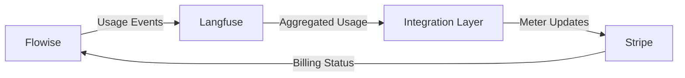

# Flowise Usage-Based Billing Guide

## Overview

Flowise implements a straightforward usage-based billing system that charges customers only for what they use. This document provides a high-level overview of our billing system and pricing structure.

### How It Works

We track three types of usage:

-   **AI Tokens**: Used when interacting with AI models
-   **Compute Time**: Processing time for running workflows
-   **Storage**: Data storage across all systems

All usage is converted to our virtual currency called "Sparks":

-   1 Spark = $0.001 USD
-   Billing is monthly
-   No minimum commitments

### Pricing Reference

| Resource Type | Measurement  | Spark Cost | Real Cost (USD) |
| ------------- | ------------ | ---------- | --------------- |
| AI Tokens     | 1,000 tokens | 100 Sparks | $0.10           |
| Compute Time  | 1 minute     | 50 Sparks  | $0.05           |
| Storage       | 1 GB/month   | 500 Sparks | $0.50           |

## System Architecture

Our billing system combines three main components:

1. **Langfuse**: Tracks all usage with millisecond precision
2. **Integration Layer**: Converts usage to billing metrics
3. **Stripe**: Handles payments and subscriptions

### Billing Cycles

-   Usage calculated monthly
-   Invoices generated on the 1st
-   Net 30 payment terms available
-   Volume discounts for high usage
-   Feature access based on subscription tier

## Security & Reliability

We ensure secure and reliable billing through:

-   Encrypted data transmission
-   Secure API key management
-   Comprehensive audit logging
-   Automatic retry mechanisms
-   Real-time monitoring
-   Automated recovery procedures

## Additional Information

For technical implementation details, please refer to:

-   [Usage Tracking Technical Specification](./usage-billing-spec.md)
-   [Usage Tracking MVP](./usage-billing-mvp.md)
-   [Usage Tracking MVP Progress](./usage-billing-mvp-progress.md)
-   [Stripe API Documentation](https://stripe.com/docs/api)
-   [Langfuse Documentation](https://langfuse.com/docs)
