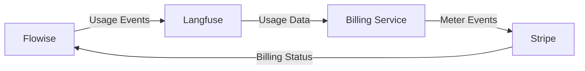

# Flowise Usage-Based Billing Guide

## Overview

Flowise implements a usage-based billing system that charges customers based on their actual resource consumption. This document provides a comprehensive overview of our billing system and pricing structure.

### How It Works

We track three types of resource usage, all converted to our virtual currency called "Sparks":

1. **AI Tokens**: Used when interacting with AI models
2. **Compute Time**: Processing time for running workflows
3. **Storage**: Data storage across all systems

### Pricing Structure

-   1 Spark = $0.0001 USD
-   30% margin applied to all usage
-   Monthly billing cycle
-   No minimum commitments

### Resource Rates

| Resource Type | Measurement  | Base Sparks | Cost (USD) |
| ------------- | ------------ | ----------- | ---------- |
| AI Tokens     | 1,000 tokens | 100         | $0.01      |
| Compute Time  | 1 minute     | 50          | $0.005     |
| Storage       | 1 GB/month   | 500         | $0.05      |

## System Architecture

Our billing system integrates three main components:


```mermaid
flowchart LR
    A[Flowise] -->|Usage Events| B[Langfuse]
    B -->|Usage Data| C[Billing Service]
    C -->|Meter Events| D[Stripe]
    D -->|Billing Status| A
```

1. **Langfuse**: Precise usage tracking
2. **Billing Service**: Usage processing and rate application
3. **Stripe**: Payment processing and subscription management

### Billing Cycles

-   Usage calculated daily
-   Monthly billing periods
-   Automatic usage synchronization
-   Real-time usage monitoring

## Usage Tracking

### Implementation

1. **Event Capture**

    - Real-time usage tracking
    - Automatic metadata collection
    - Resource type categorization
    - Cost calculation

2. **Usage Processing**

    - Batch processing (15 events per batch)
    - Automatic retries
    - Error handling
    - Usage aggregation

3. **Billing Updates**
    - Daily usage sync
    - Automatic meter updates
    - Invoice generation
    - Payment processing

### Usage Metadata

```typescript
interface UsageMetrics {
    ai_tokens?: UsageMetric
    compute?: UsageMetric
    storage?: UsageMetric
    total_sparks?: number
    total_cost?: number
    billing_period?: {
        start: string
        end: string
    }
}
```

## Security & Reliability

### Security Measures

1. **API Security**

    - Secure key management
    - Request signing
    - Rate limiting

2. **Data Protection**
    - Encryption at rest
    - Secure transmission
    - Access control

### Reliability Features

1. **Error Handling**

    - Automatic retries
    - Fallback mechanisms
    - Error reporting

2. **Data Consistency**
    - Transaction-based updates
    - Usage verification
    - Audit logging

## Monitoring & Alerts

### Key Metrics

1. Usage patterns
2. Processing success rates
3. Error frequencies
4. Resource utilization
5. Cost trends

### Alert Types

1. Usage spikes
2. Processing failures
3. Rate limit warnings
4. Quota notifications
5. Payment issues

## API Reference

### Usage Tracking

```typescript
// Get usage statistics
GET /billing/usage/stats

Response:
{
    ai_tokens: {
        total: number
        daily: Array<{ date: Date, value: number }>
    },
    compute: {
        total: number
        daily: Array<{ date: Date, value: number }>
    },
    storage: {
        total: number
        daily: Array<{ date: Date, value: number }>
    },
    total_sparks: number,
    total_cost: number
}
```

### Subscription Management

```typescript
// Create subscription
POST /billing/subscriptions
Body: {
    priceId: string
    customerId: string
}

// Update subscription
PUT /billing/subscriptions/:id
Body: {
    priceId: string
}

// Cancel subscription
DELETE /billing/subscriptions/:id
```

## Configuration

### Environment Variables

```bash
# Stripe Configuration
STRIPE_SECRET_KEY=sk_test_...
STRIPE_WEBHOOK_SECRET=whsec_...
DEFAULT_CUSTOMER_ID=cus_...

# Langfuse Configuration
LANGFUSE_PUBLIC_KEY=pk_...
LANGFUSE_SECRET_KEY=sk_...
```

### Rate Configuration

```typescript
const BILLING_CONFIG = {
    SPARK_TO_USD: 0.0001,
    MARGIN_MULTIPLIER: 1.3,
    BATCH_SIZE: 15,
    RETRY_ATTEMPTS: 3,
    SYNC_INTERVAL: 300000 // 5 minutes
}
```

## Best Practices

### Usage Tracking

1. Monitor usage patterns regularly
2. Set up usage alerts
3. Review cost allocation
4. Validate usage calculations
5. Maintain audit trails

### Error Handling

1. Monitor error rates
2. Review failed transactions
3. Set up error alerts
4. Maintain error logs
5. Regular system health checks

## Support

For technical support or billing inquiries:

-   Email: support@flowise.ai
-   Documentation: docs.flowise.ai/billing
-   API Reference: api.flowise.ai/billing
